Initiation à R
========================================================
author: DREES
date: 2018-02-14
autosize: false
width: 2200
height: 1000


Qu'est ce que R ?
========================================================

### R (https://www.r-project.org/) est un langage de programmation dédié à l'analyse statistique.
### Libre et gratuit, disponible sur toutes les plateformes (Mac OS, Windows, Linux), il s'est largement imposé ces dernières années dans le domaine des sciences humaines et de la datascience.
### R dispose par défaut d'instructions de base permettant de réaliser les opérations les plus courantes.
### De nouvelles fonctionnalités, regroupées en packages, peuvent être facilement ajoutées pour venir enrichir les possibilités du langage.
### Le point fort de R par rapport à des logiciels à interfaces graphiques, est qu'il permet très facilement l'automatisation et la reproductibilité des traitements.

Environnement de travail
========================================================

### Rstudio (https://www.rstudio.com/) est un environnement de travail permettant d'écrire du code R. 
### Il ne s'agit pas d'un environnement clic bouton mais d'une véritable interface de développement (IDE) destiné à écrire du code. 
### Il s'agit en fait d'une couche logiciel permettant d'écrire, d'exécuter et de visualiser les résultats d'un programme écrit dans le langage R. 
### RStudio n'est pas indispensable pour utiliser R. Néanmoins,  il est très pratique et très bien fait.

Répertoire par défaut
========================================================
Le menu Session > Set Working Directory permet de sélectionner le répertoire par défaut contenant vos scripts et éventuels fichiers de données.<br>
Vous pouvez également le modifier via une ligne de code :


```r
setwd('C:/Users/phileas.condemine/Documents/R_initiation/')
```

Une autre approche, souvent préférable, est l'utilisation des projets.<br>
Le bouton situé en haut à droite de l'environnement RStudio permet de gérer les projets.<br>
Dans un projet l'environnement de travail est automatiquement défini comme le lieu d'emplacement du projet (fichier .Rproj).<br>
Le fichier en lui même est très simple mais peut-être paramétré.

```r
print(readLines("R_initiation.Rproj"))
```

```
 [1] "Version: 1.0"               ""                          
 [3] "RestoreWorkspace: Default"  "SaveWorkspace: Default"    
 [5] "AlwaysSaveHistory: Default" ""                          
 [7] "EnableCodeIndexing: Yes"    "UseSpacesForTab: Yes"      
 [9] "NumSpacesForTab: 2"         "Encoding: UTF-8"           
[11] ""                           "RnwWeave: Sweave"          
[13] "LaTeX: pdfLaTeX"           
```

Quelques raccourcis dans RStudio
========================================================
<ul>
<li> [ctrl+entrée] pour compiler une ligne, vous pouvez placer le curseur dessus et cliquer sur Run, ou bien utiliser le raccourci clavier .
<li> [TAB] pour utiliser l'autocomplétion d'un nom de fonction, de variable ou de fichier (si des entre guillements "")
<li> [Ctrl + Shift + 1] Pour ouvrir le code en plein écran, refaire le même raccourci pour revenir à l'affichage 4 fenêtres
<li> [Ctrl + Shift + 2] Pour ouvrir la console en plein écran, refaire le même raccourci pour revenir à l'affichage 4 fenêtres
<li> [Ctrl + Alt + i] Pour créer un nouveau chunk de code R dans un fichier .Rmd ou .Rpres
<li> [Alt +  -] Pour créer un signe ` <- `
</ul>


Objets et formats en théorie
========================================================
### Sous R, les éléments de base sont des objets : 
<ul>
<li>vecteurs, 
<li>matrices, 
<li>listes, 
<li>table appelées <b>data.frame</b> ...
</ul>
### Ces objets peuvent contenir des éléments de type 
<ul>
<li>numérique, 
<li>booléen (logical : TRUE, FALSE), 
<li>chaîne de caractère (string), 
<li>facteur (factor, pour les variables qualitatives prenant un nombre déterminé de modalités). 
</ul>
### La différence entre la table de données (data.frame) et la matrice tient notamment dans le fait que la première peut contenir des éléments de types différents. 

Packages
========================================================

```r
sapply(c("ggplot2","plotly","factoextra","webshot","dplyr"),function(x){
  library(x,character.only=T,quietly = T)
  })
```

```
$ggplot2
[1] "ggplot2"   "knitr"     "stats"     "graphics"  "grDevices" "utils"    
[7] "datasets"  "methods"   "base"     

$plotly
 [1] "plotly"    "ggplot2"   "knitr"     "stats"     "graphics" 
 [6] "grDevices" "utils"     "datasets"  "methods"   "base"     

$factoextra
 [1] "factoextra" "plotly"     "ggplot2"    "knitr"      "stats"     
 [6] "graphics"   "grDevices"  "utils"      "datasets"   "methods"   
[11] "base"      

$webshot
 [1] "webshot"    "factoextra" "plotly"     "ggplot2"    "knitr"     
 [6] "stats"      "graphics"   "grDevices"  "utils"      "datasets"  
[11] "methods"    "base"      

$dplyr
 [1] "dplyr"      "webshot"    "factoextra" "plotly"     "ggplot2"   
 [6] "knitr"      "stats"      "graphics"   "grDevices"  "utils"     
[11] "datasets"   "methods"    "base"      
```

Types de données et manipulations de base
========================================================
type:section

Nombres
========================================================
type:sub-section

Nombres - Opérations simples
========================================================

On commence par créer des éléments pour illustrer les opérations de base en R.<br>
Le signe `<-` est très souvent équivalent à `=`<br>
Ils permettent d'assigner un contenu à une variable dont on indique le nom à gauche.
On peut ensuite avoir un aperçu de ces variables dans l'onglet Environment (par défaut en haut à droite).

```r
element_a <- 2
element_a
```

```
[1] 2
```

```r
element_b <- 3
element_b
```

```
[1] 3
```

```r
element_c <- element_a/2 + 2*element_b # les opérations -, *, /, sqrt pour racine, ^ pour puissance, log, exp, sont également possibles !
element_c
```

```
[1] 7
```

Vecteurs
========================================================
type:sub-section

Vecteurs - Création et combinaison
========================================================
On peut travailler très naturellement sur des vecteurs<br>
Le vecteur est le format par défaut en R. Un nombre seul ie un scalaire est un vecteur de taille 1.<br>
c() veut dire combine parce que cet opérateur permet de combiner des vecteurs (y compris de taille 1).


```r
vecteur_a <- c(2,3,5) 
vecteur_a
```

```
[1] 2 3 5
```


```r
vecteur_b <- c(-1,0,1)
vecteur_b
```

```
[1] -1  0  1
```


```r
vecteur_c <- c(vecteur_a,27,vecteur_b) 
vecteur_c
```

```
[1]  2  3  5 27 -1  0  1
```

Vecteurs - Indexation et sous-vecteur
========================================================
L'indexation en R commence à 1 contrairement à l'indexation en Python qui commence à 0.<br>
On peut récupérer un ou plusieurs éléments d'un vecteur avec l'opérateur `[` <br>


```r
vecteur_a
```

```
[1] 2 3 5
```

```r
vecteur_a[1] #on commence à numéroter à partir de 1 (et non de zéro)
```

```
[1] 2
```

```r
vecteur_a[c(1,3)]
```

```
[1] 2 5
```

Vecteurs - Fonctions de création de vecteurs
========================================================
Dans le cas où le vecteur correspond à une séquence de nombres, on peut utiliser une syntaxe particulière


```r
vecteur_a <- c(2,3,4) 
vecteur_b <- 2:4
vecteur_c <- seq(2,4,1) #seq(from = 2,to = 4,by = 1)  (à partir de 2, jusqu'à 4, avec un pas de 1)
```
Remarque, si on ne sait plus la signification des trois arguments de `seq`, on peut aller dans l'aide avec `?seq` <br>


Un vecteur peut également être généré à partir d'un tirage aléatoire


```r
vecteur_d <- sample(1:10,6)#sample(x = 1:10,size = 6) on tire 6 nombres dans le vecteur 1:10
vecteur_d
```

```
[1]  4  6  8 10  1  9
```

Cette fonction permet aussi de mélanger un vecteur

```r
sample(vecteur_d)
```

```
[1] 10  8  6  1  9  4
```


Vecteurs - Opérations simples
========================================================
Les opérations sur les vecteurs sont très proches des opérations sur les éléments. <br>
Une opération entre un vecteur a et un vecteur b revient à réaliser l'opération entre les couples d'éléments issus des deux vecteurs et situés à la même place (il faut que les vecteurs aient la même taille pour que ça ait un sens). <br>


```r
vecteur_a == vecteur_b # compare les éléments un à un
```

```
[1] TRUE TRUE TRUE
```

```r
variable_logique_a <- vecteur_a == vecteur_b
```

Vecteurs - Opérations simples
========================================================
Si la taille d'un vecteur est multiple de la taille de l'autre, les opérations fonctionnent mais il faut en comprendre la logique.


```r
vecteur_e = sample(2:4,9,replace = T)
vecteur_e
```

```
[1] 4 4 4 3 2 4 2 3 2
```

```r
vecteur_a
```

```
[1] 2 3 4
```

```r
vecteur_e == vecteur_a # compare chaque élément à une même valeur
```

```
[1] FALSE FALSE  TRUE FALSE FALSE  TRUE  TRUE  TRUE FALSE
```

```r
vecteur_e == 3
```

```
[1] FALSE FALSE FALSE  TRUE FALSE FALSE FALSE  TRUE FALSE
```

Cette souplesse du langage R est avantageuse mais peut être dangereuse en cas d'ambiguité.

Vecteurs - Opérations simples
========================================================

```r
vecteur_c
```

```
[1] 2 3 4
```

```r
vecteur_c <- 2*vecteur_c # on écrase la valeur du vecteur_c
vecteur_c
```

```
[1] 4 6 8
```

```r
vecteur_c + vecteur_a/2 # exemple d'opération entre deux vecteurs
```

```
[1]  5.0  7.5 10.0
```
Le vecteur d'entiers est devenu un vecteur de décimaux.

Vecteurs - Fonctions de base
========================================================
Le vecteur est caractérisé notamment par sa taille 


```r
length(vecteur_a)
```

```
[1] 3
```

Il peut-être trié :


```r
vecteur_d <- c(3,1,2,0)
ordre=order(vecteur_d)#Ceci nous donne l'ordre des indices
ordre
```

```
[1] 4 2 3 1
```

```r
vecteur_d[ordre]
```

```
[1] 0 1 2 3
```

```r
sort(vecteur_d)
```

```
[1] 0 1 2 3
```

Listes
========================================================
type:sub-section

Listes - Création
========================================================


```r
liste_a <- list(2,3,5)
liste_a
```

```
[[1]]
[1] 2

[[2]]
[1] 3

[[3]]
[1] 5
```

```r
liste_a[[2]]
```

```
[1] 3
```

```r
liste_b <- list(sexe = 2, age = 3, salaire = 5)
liste_b$salaire # si on donne des noms aux éléments de la liste, on peut les récupérer via l'opérateur $
```

```
[1] 5
```

Listes - Combinaison
========================================================

Pour concaténer deux listes 


```r
liste_a <- append(liste_a, element_a) # ou liste_b à la place de element_a pour concaténer deux listes
liste_a
```

```
[[1]]
[1] 2

[[2]]
[1] 3

[[3]]
[1] 5

[[4]]
[1] 2
```

Listes - Liste de listes
========================================================

Pour concaténer deux listes 


```r
lliste_a <- list(liste_a, element_a) # ou liste_b à la place de element_a pour concaténer deux listes
lliste_a
```

```
[[1]]
[[1]][[1]]
[1] 2

[[1]][[2]]
[1] 3

[[1]][[3]]
[1] 5

[[1]][[4]]
[1] 2


[[2]]
[1] 2
```


Listes - Fonctions de bases
========================================================
La fonction `length` convient aussi pour les listes 


```r
length(liste_a)
```

```
[1] 4
```

On peut passer de la liste au vecteur avec la fonction `unlist()` <br>


```r
unlist(liste_a)
```

```
[1] 2 3 5 2
```

Tout est mis à plat, remarquer le comportement de `unlist()` pour la liste de listes.


```r
unlist(lliste_a)
```

```
[1] 2 3 5 2 2
```

Matrices
========================================================
type:sub-section

Matrices - Création
========================================================

```r
matrice_a <- matrix(1:15,ncol=5) # exemple d'une matrice remplie des chiffres consécutifs de 1 à 15 rangés sur 5 colonnes 
matrice_a
```

```
     [,1] [,2] [,3] [,4] [,5]
[1,]    1    4    7   10   13
[2,]    2    5    8   11   14
[3,]    3    6    9   12   15
```

```r
head(matrice_a) # la fonction head permet de visualiser un extrait des données, ici elles sont petites donc c'est la totalité
```

```
     [,1] [,2] [,3] [,4] [,5]
[1,]    1    4    7   10   13
[2,]    2    5    8   11   14
[3,]    3    6    9   12   15
```

```r
matrice_a[1,2] # pour récupérer l'élément de la première ligne et de la deuxième colonne 
```

```
[1] 4
```

Matrices - Opérations simples
========================================================
Par défaut, les opérations mathématiques simples se font élément par élément 


```r
matrice_b <- 3*matrice_a
matrice_a
```

```
     [,1] [,2] [,3] [,4] [,5]
[1,]    1    4    7   10   13
[2,]    2    5    8   11   14
[3,]    3    6    9   12   15
```

```r
matrice_b
```

```
     [,1] [,2] [,3] [,4] [,5]
[1,]    3   12   21   30   39
[2,]    6   15   24   33   42
[3,]    9   18   27   36   45
```

```r
matrice_b - matrice_a # les opérations se font éléments par élément
```

```
     [,1] [,2] [,3] [,4] [,5]
[1,]    2    8   14   20   26
[2,]    4   10   16   22   28
[3,]    6   12   18   24   30
```

Matrices - Fonctions de base
========================================================
Les dimensions de la matrice peuvent être obtenues de la manière suivante :


```r
nrow(matrice_a)
```

```
[1] 3
```

```r
ncol(matrice_a)
```

```
[1] 5
```

```r
dim(matrice_a)
```

```
[1] 3 5
```

Matrices - Fonctions de base [cbind]
========================================================
Pour concaténer deux matrices, on peut 
<ul>
<li>Soit les mettre côte à côte (`cbind`). Ici c veut dire colonne. 
<li>Soit les empiler (`rbind`). Ici r veut dire row donc ligne.
</ul>
Ces fonctions fonctionnent aussi pour les data.frames.


```r
matrice_c <- cbind(matrice_a, matrice_b)
matrice_c
```

```
     [,1] [,2] [,3] [,4] [,5] [,6] [,7] [,8] [,9] [,10]
[1,]    1    4    7   10   13    3   12   21   30    39
[2,]    2    5    8   11   14    6   15   24   33    42
[3,]    3    6    9   12   15    9   18   27   36    45
```

```r
dim(matrice_c)
```

```
[1]  3 10
```


Matrices - Fonctions de base [rbind]
========================================================
Pour concaténer deux matrices, on peut 
<ul>
<li>Soit les mettre côte à côte (`cbind`). Ici c veut dire colonne. 
<li>Soit les empiler (`rbind`). Ici r veut dire row donc ligne.
</ul>
Ces fonctions fonctionnent aussi pour les data.frames.


```r
matrice_d <- rbind(matrice_a, matrice_b)
matrice_d
```

```
     [,1] [,2] [,3] [,4] [,5]
[1,]    1    4    7   10   13
[2,]    2    5    8   11   14
[3,]    3    6    9   12   15
[4,]    3   12   21   30   39
[5,]    6   15   24   33   42
[6,]    9   18   27   36   45
```

```r
dim(matrice_d)
```

```
[1] 6 5
```

Matrices - Produits
========================================================

```r
matrice_b*matrice_a # cette opération réalise le produit élément par élément et non le produit matriciel. Les matrices doivent être de mêmes dimensions.
```

```
     [,1] [,2] [,3] [,4] [,5]
[1,]    3   48  147  300  507
[2,]   12   75  192  363  588
[3,]   27  108  243  432  675
```

```r
t(matrice_b)%*% matrice_a # pour faire des vrais produits matriciels, on utilise l'opérateur %*%, ici t() indique que l'on prend également la transposée
```

```
     [,1] [,2] [,3] [,4] [,5]
[1,]   42   96  150  204  258
[2,]   96  231  366  501  636
[3,]  150  366  582  798 1014
[4,]  204  501  798 1095 1392
[5,]  258  636 1014 1392 1770
```


Data.frame
========================================================
type:sub-section

Data.frame - Création
========================================================
Les tables de données ou data.frame est sans doute le format qu'on utilisera le plus dans la suite. 


```r
df_a <- as.data.frame(matrice_a) # on commence par transformer la matrice en data.frame, l'opération symétrique as.matrix() est possible
head(df_a) 
```

```
  V1 V2 V3 V4 V5
1  1  4  7 10 13
2  2  5  8 11 14
3  3  6  9 12 15
```

```r
names(df_a) # ici le data.frame provient de la conversion d'une matrice, il n'y a donc pas de noms de colonnes à part ceux qui sont donnés par défaut V1, V2...
```

```
[1] "V1" "V2" "V3" "V4" "V5"
```

```r
names(df_a) <- c('a','b','c','d','e') # on peut changer le nom des colonnes simplement
names(df_a)
```

```
[1] "a" "b" "c" "d" "e"
```

Data.frame - Indexation et extraction
========================================================

Pour récupérer de l'information dans la table de données, on peut procéder de différentes manières 


```r
df_a$b # avec l'opérateur $, on peut récupérer directement la colonne b
```

```
[1] 4 5 6
```

```r
df_a[['b']] # revient au même
```

```
[1] 4 5 6
```

```r
df_a[[2]] # correspond également car il s'agit de la 2e colonne
```

```
[1] 4 5 6
```

```r
df_a$e <- 1 # permet de construire une nouvelle colonne e remplie de 1 
head(df_a)
```

```
  a b c  d e
1 1 4 7 10 1
2 2 5 8 11 1
3 3 6 9 12 1
```

Data.frame - Indexation et extraction
========================================================


```r
df_a$f <- df_a$a + df_a$b # permet de construire une nouvelle colonne qui serait la somme des deux premières, les opération -, *, /, sqrt pour racine carrée, log, exp, ^, sont également possibles ! 
head(df_a)
```

```
  a b c  d e f
1 1 4 7 10 1 5
2 2 5 8 11 1 7
3 3 6 9 12 1 9
```

```r
df_a$f <- sqrt(df_a$a) + df_a$b^2 # permet de construire une nouvelle colonne qui serait la somme des deux premières, les opération -, *, /, sqrt pour racine 
df_a$f
```

```
[1] 17.00000 26.41421 37.73205
```

Recapitulation des formats de données
========================================================
type:sub-section

Formats en pratique
========================================================
Vérifions le type de ces objets avec la fonction `class`


```r
c(class(element_a),
class(vecteur_a),
class(variable_logique_a),
class(liste_a),
class(matrice_a),
class(df_a))
```

```
[1] "numeric"    "numeric"    "logical"    "list"       "matrix"    
[6] "data.frame"
```

Environment - consultation et suppression
========================================================
Nous avons créé un certain nombre de variables qui sont disponibles dans votre environnement (généralement en haut à droite par défaut)<br>
En passant de list à grid on change les informations affichées sur les objets, en particulier on peut voir la taille (occupée en RAM) et le format.<br>
On peut aussi utiliser la fonction `ls` pour voir la liste des objets dont on dispose, et `rm` pour en supprimer.
`ls` = list segments<br>
`rm` = remove<br>
Ces verbes sont hérités de `bash`/`cmd`<br>

```r
head(ls())
```

```
[1] "df_a"      "element_a" "element_b" "element_c" "liste_a"   "liste_b"  
```

```r
rm(element_a)
head(ls())
```

```
[1] "df_a"      "element_b" "element_c" "liste_a"   "liste_b"   "lliste_a" 
```

Algorithmique
========================================================
type:section

Boucles
========================================================
type:sub-section

Boucles - Cas d'usage
========================================================
Reprenons le cas où on a un data.frame simple.<br>
On veut calculer la moyenne, la somme, le maximum et le minimum de chaque colonne. <br>
Une manière de le faire serait de faire une <b>boucle</b> sur le nombre de colonnes et d'appliquer la fonction 
<ul>
<li>`mean`
<li>`sum`
<li>`max`
<li>`min`
</ul>
à chaque colonne tour à tour.


Boucles - for (i in vec){fonction(i)}
========================================================

```r
nb_col <- ncol(df_a) 
mean_col <- NULL # on commence par créer une variable vide, dans laquelle on va ajouter itérativement les moyenne de chaque colonne
for (i in 1:nb_col){
  print(paste("numéro de la variable :",i))
  mean_temp <- mean(df_a[[i]])
  print(paste("moyenne de la variable i:",mean_temp))
  mean_col <- c(mean_col, mean_temp)
  print(paste("vecteur des moyennes",mean_col))
  print(paste("vecteur des moyennes",paste(mean_col,collapse = " ")))#Attention paste(), comme la plupart des fonctions R est vectorielle, elle essaie donc de s'appliquer au vecteur élément par élément
  print('---------')}
```

```
[1] "numéro de la variable : 1"
[1] "moyenne de la variable i: 2"
[1] "vecteur des moyennes 2"
[1] "vecteur des moyennes 2"
[1] "---------"
[1] "numéro de la variable : 2"
[1] "moyenne de la variable i: 5"
[1] "vecteur des moyennes 2" "vecteur des moyennes 5"
[1] "vecteur des moyennes 2 5"
[1] "---------"
[1] "numéro de la variable : 3"
[1] "moyenne de la variable i: 8"
[1] "vecteur des moyennes 2" "vecteur des moyennes 5"
[3] "vecteur des moyennes 8"
[1] "vecteur des moyennes 2 5 8"
[1] "---------"
[1] "numéro de la variable : 4"
[1] "moyenne de la variable i: 11"
[1] "vecteur des moyennes 2"  "vecteur des moyennes 5" 
[3] "vecteur des moyennes 8"  "vecteur des moyennes 11"
[1] "vecteur des moyennes 2 5 8 11"
[1] "---------"
[1] "numéro de la variable : 5"
[1] "moyenne de la variable i: 1"
[1] "vecteur des moyennes 2"  "vecteur des moyennes 5" 
[3] "vecteur des moyennes 8"  "vecteur des moyennes 11"
[5] "vecteur des moyennes 1" 
[1] "vecteur des moyennes 2 5 8 11 1"
[1] "---------"
[1] "numéro de la variable : 6"
[1] "moyenne de la variable i: 27.0487547899807"
[1] "vecteur des moyennes 2"               
[2] "vecteur des moyennes 5"               
[3] "vecteur des moyennes 8"               
[4] "vecteur des moyennes 11"              
[5] "vecteur des moyennes 1"               
[6] "vecteur des moyennes 27.0487547899807"
[1] "vecteur des moyennes 2 5 8 11 1 27.0487547899807"
[1] "---------"
```

Boucles - for (i in vec){fonction(i)}
========================================================

```
[1] "numéro de la variable : 1"
[1] "moyenne de la variable i: 2"
[1] "vecteur des moyennes 2"
[1] "vecteur des moyennes 2"
[1] "---------"
[1] "numéro de la variable : 2"
[1] "moyenne de la variable i: 5"
[1] "vecteur des moyennes 2" "vecteur des moyennes 5"
[1] "vecteur des moyennes 2 5"
[1] "---------"
[1] "numéro de la variable : 3"
[1] "moyenne de la variable i: 8"
[1] "vecteur des moyennes 2" "vecteur des moyennes 5"
[3] "vecteur des moyennes 8"
[1] "vecteur des moyennes 2 5 8"
[1] "---------"
[1] "numéro de la variable : 4"
[1] "moyenne de la variable i: 11"
[1] "vecteur des moyennes 2"  "vecteur des moyennes 5" 
[3] "vecteur des moyennes 8"  "vecteur des moyennes 11"
[1] "vecteur des moyennes 2 5 8 11"
[1] "---------"
[1] "numéro de la variable : 5"
[1] "moyenne de la variable i: 1"
[1] "vecteur des moyennes 2"  "vecteur des moyennes 5" 
[3] "vecteur des moyennes 8"  "vecteur des moyennes 11"
[5] "vecteur des moyennes 1" 
[1] "vecteur des moyennes 2 5 8 11 1"
[1] "---------"
[1] "numéro de la variable : 6"
[1] "moyenne de la variable i: 27.0487547899807"
[1] "vecteur des moyennes 2"               
[2] "vecteur des moyennes 5"               
[3] "vecteur des moyennes 8"               
[4] "vecteur des moyennes 11"              
[5] "vecteur des moyennes 1"               
[6] "vecteur des moyennes 27.0487547899807"
[1] "vecteur des moyennes 2 5 8 11 1 27.0487547899807"
[1] "---------"
```


Boucles - apply(vec, fonction)
========================================================

En réalité, les boucles sont à éviter en R, elles ne sont pas efficaces.<br>
on leur préférera les fonctions de la famille `apply`. <br>
Par exemple la fonction `lapply` qui distribue la fonction souhaitée sur chaque élément d'une liste (et retourne une liste). Un data.frame peut-être vu comme une liste de vecteurs. 
<ul>
<li> apply sur un data.frame, s'applique sur les lignes, les colonnes ou chaque élément, essaie de renvoyer un data.frame
<li> lapply, l comme liste, essaie de renvoyer une liste.
<li> sapply, s comme simplify, plus souple que lapply.
<li> rapply, r comme recursif, version recursive de lapply.
<li> mapply pour une version multivariée de sapply.
</ul>


Boucles - [sapply]
========================================================

```r
mean_col <- lapply(df_a, mean) # ici la fonction est particulièrement simple car mean est déjà une fonction R
mean_col
```

```
$a
[1] 2

$b
[1] 5

$c
[1] 8

$d
[1] 11

$e
[1] 1

$f
[1] 27.04875
```
Boucles - [lapply]
========================================================

```r
mean_col <- sapply(df_a, mean) # sapply procède de même mais renvoie un vecteur
mean_col
```

```
       a        b        c        d        e        f 
 2.00000  5.00000  8.00000 11.00000  1.00000 27.04875 
```

Fonctions
========================================================
type:sub-section

Fonction définie par l'utilisateur [function & return]
========================================================
Admettons qu'on cherche à appliquer une fonction personnalisée 


```r
mean_personnalisee <- function(vect){
  return(sum(vect)/length(vect))
}
v=c(1,5,3,4,10)
mean_personnalisee(v)
```

```
[1] 4.6
```

Retour aux boucles
========================================================
type:sub-section

Boucles - sapply() sur une fonction définie par l'utilisateur
========================================================
Admettons qu'on cherche à appliquer une fonction personnalisée 

```r
mean_col <- sapply(df_a, function(vect) mean_personnalisee(vect))
mean_col
```

```
       a        b        c        d        e        f 
 2.00000  5.00000  8.00000 11.00000  1.00000 27.04875 
```

Boucles - lapply() sur une fonction définie par l'utilisateur
========================================================
Appliquée sur un vecteur, `lapply` le convertit en liste, on peut repasser à un format vecteur avec la fonction `unlist`


```r
fonction_personnalisee <- function(x){
  return(x*log(x))
}
v
```

```
[1]  1  5  3  4 10
```

```r
fonction_personnalisee(v)
```

```
[1]  0.000000  8.047190  3.295837  5.545177 23.025851
```


Boucles - lapply() sur une fonction définie par l'utilisateur
========================================================
Appliquée sur un vecteur, `lapply` le convertit en liste, on peut repasser à un format vecteur avec la fonction `unlist`


```r
vecteur_a_transforme <- lapply(vecteur_a, function(x) fonction_personnalisee(x))
class(vecteur_a_transforme)
```

```
[1] "list"
```

```r
vecteur_a_transforme
```

```
[[1]]
[1] 1.386294

[[2]]
[1] 3.295837

[[3]]
[1] 5.545177
```

```r
unlist(vecteur_a_transforme)
```

```
[1] 1.386294 3.295837 5.545177
```

```r
vecteur_a*log(vecteur_a) # aurait marché aussi !
```

```
[1] 1.386294 3.295837 5.545177
```

Boucles - apply() sur les lignes, les colonnes, les éléments
========================================================
`apply` s'applique aussi à des matrices, on indique alors si la fonction à distribuer doit être distribuée en ligne ou en colonne 


```r
matrice_a
```

```
     [,1] [,2] [,3] [,4] [,5]
[1,]    1    4    7   10   13
[2,]    2    5    8   11   14
[3,]    3    6    9   12   15
```

```r
apply(matrice_a,1,sum) # ici on applique la fonction somme, autrement dit on somme les éléments par ligne
```

```
[1] 35 40 45
```

```r
apply(matrice_a,2,sum) # par colonne
```

```
[1]  6 15 24 33 42
```

```r
apply(matrice_a,c(1,2),sqrt) # pour chaque élément
```

```
         [,1]     [,2]     [,3]     [,4]     [,5]
[1,] 1.000000 2.000000 2.645751 3.162278 3.605551
[2,] 1.414214 2.236068 2.828427 3.316625 3.741657
[3,] 1.732051 2.449490 3.000000 3.464102 3.872983
```


Conditions
========================================================
type:sub-section

Condition - if() else()
========================================================

La syntaxe de la condition est très proche de celle de la boucle, sauf que l'on remplace `for` par `if`


```r
fonction_personnalisee <- function(x){
  if (x>0){res <- x*log(x)}
  else {res <- 0}
  return(res)
}
```


```r
vecteur_d <- c(10,0,-1,2)
sapply(vecteur_d, function(x) fonction_personnalisee(x))
```

```
[1] 23.025851  0.000000  0.000000  1.386294
```

```r
abs(vecteur_d) # rmq : abs permet de passer un élément en valeur absolue (s'applique également aux vecteurs sans recours à lapply)
```

```
[1] 10  0  1  2
```

Ici on a inclus la condition dans une fonction, mais ce n'est pas indispensable ! <br>

Condition - if() else()
========================================================
On peut vouloir aussi tester la différence `!=` plutôt que l'égalité, `<` ou `>`, et si on a plusieurs conditions, on mettra chacune entre parenthèse et on utilisera `|` pour dire "ou" et `&` pour dire "et" (par exemple `(b-3==a) & (b>=a)`).
Parfois, on n'a pas besoin de passer par `if` pour appliquer une condition, par exemple si on veut récupérer seulement les éléments de vecteur_d supérieurs ou égaux à 0. Cela revient à dire qu'on teste la condition sur chaque élément et qu'on conserve vecteur_d[i] pour i tel que vecteur_d[i]>=0
 

```r
vecteur_d
```

```
[1] 10  0 -1  2
```

```r
vecteur_d[vecteur_d>=0]
```

```
[1] 10  0  2
```

Et ça fonctionne aussi avec les data.frames


```r
df_a[df_a$a>2] # on ne garde que les colonnes qui vérifient cette condition
```

```
  c        f
1 7 17.00000
2 8 26.41421
3 9 37.73205
```

Types des variables
========================================================
type:section

Chaînes de caractères
========================================================
type:sub-section

Chaînes de caractères - Introduction
========================================================
Il arrive que les objets que l'on manipule ne soit pas numériques, on parle alors de `character` ou de `factor`. C'est le cas par exemple des noms de colonnes de `df_a`.<br>
Le format `character` est le type le plus souple et aussi le plus brouillon (non traité par la plupart des modèles lm, glm, gbm, randomforests...). <br>
Souvent lorsque le type d'une colonne n'est pas clair, R lui attribura le type character. 


```r
class(names(df_a))
```

```
[1] "character"
```


Chaînes de caractères - Fonctions de base [paste & rep]
========================================================

On peut aussi réaliser des opérations, par exemple de concaténation. Imaginons que l'on souhaite préciser les noms de colonnes en indiquant qu'il s'agit de département.


```r
paste('departement','test',sep='_')
```

```
[1] "departement_test"
```

```r
paste(rep('departement',5), names(df_a),sep='_') 
```

```
[1] "departement_a" "departement_b" "departement_c" "departement_d"
[5] "departement_e" "departement_f"
```

```r
names(df_a) <- paste(rep('departement',5), names(df_a),sep='_') # revient à faire apply de paste sur tous les éléments du vecteur names(df_a)
rep('departement',5) # rep est la fonction qui permet de créer des vecteurs d'une taille donnée contenant toujours le même élément qui pourrait être numérique
```

```
[1] "departement" "departement" "departement" "departement" "departement"
```

Chaînes de caractères - Extraction substr() et strsplit()
========================================================
On peut récupérer une partie d'une chaine de caractère simplement 


```r
character_a <- 'departement_a' 
class(character_a)
```

```
[1] "character"
```

```r
substr(character_a,1,10) #les arguments correspondent à la chaine, au début de la sous-chaîne que l'on veut récupérer, et à la fin de la sous-chaîne que l'on veut récupérer
```

```
[1] "departemen"
```

```r
strsplit(character_a,'_') #les arguments correspondent à la chaine et au caractère qui au niveau duquel on veut couper
```

```
[[1]]
[1] "departement" "a"          
```

```r
strsplit(character_a,'_')[[1]][[2]] #le résultat est une liste donc on utilise les doubles crochets pour récupérer l'élément qui nous intéresse
```

```
[1] "a"
```

Chaînes de caractères - Taille nchar
========================================================
La taille d'une chaine de caractères correspond au nombre de caractères 


```r
nchar(character_a)
```

```
[1] 13
```

```r
df_a$dep=c("Paris","Montpellier","Lyon")
df_a$dep_len=nchar(df_a$dep)
df_a[,c("dep","dep_len")]
```

```
          dep dep_len
1       Paris       5
2 Montpellier      11
3        Lyon       4
```

Facteurs
========================================================
type:sub-section

Facteurs - Introduction
========================================================

Les facteurs correspondent aux modalités d'une variable qualitative. 


```r
col_df_a <- names(df_a)
col_df_a_fact <- as.factor(col_df_a)
is.character(col_df_a_fact)
```

```
[1] FALSE
```

```r
class(col_df_a)
```

```
[1] "character"
```

```r
class(col_df_a_fact)
```

```
[1] "factor"
```


Facteurs - Quelques pièges (ajout de modalités)
========================================================

On ne peut pas rajouter un élément qui n'est pas dans la liste des facteurs naïvement 


```r
levels(col_df_a_fact) #liste des modalités de la variable factorielle
```

```
[1] "dep"           "dep_len"       "departement_a" "departement_b"
[5] "departement_c" "departement_d" "departement_e" "departement_f"
```

```r
col_df_a_fact <- c(col_df_a_fact, 'departement_z')# attention cette opération a converti col_df_a_fact en character
class(col_df_a_fact) 
```

```
[1] "character"
```

```r
col_df_a_fact 
```

```
[1] "3"             "4"             "5"             "6"            
[5] "7"             "8"             "1"             "2"            
[9] "departement_z"
```

```r
levels(col_df_a_fact) #Seuls les vecteurs de type factor sont vus comme des variables qualitatives
```

```
NULL
```

Facteurs - Quelques pièges (conversion)
========================================================

```r
col_df_a_fact <- as.factor(col_df_a)
as.character(col_df_a_fact) # parfois on préfère revenir aux chaines de caractères pour éviter ce type de problèmes 
```

```
[1] "departement_a" "departement_b" "departement_c" "departement_d"
[5] "departement_e" "departement_f" "dep"           "dep_len"      
```
Si une variable numérique est au format facteur et qu'on veut revenir au format numérique, il faut passer par le format character. Sinon on obtient le numéro de la modalité de chaque élément.

```r
fac <- factor(c(1,12,4,2,3,5))
levels(fac)
```

```
[1] "1"  "2"  "3"  "4"  "5"  "12"
```

```r
as.numeric(fac)
```

```
[1] 1 6 4 2 3 5
```

```r
as.numeric(as.character(fac))
```

```
[1]  1 12  4  2  3  5
```

Génération d'aléa
========================================================
type:section

Génération d'aléa - tirage multinomial [sample]
========================================================
On a souvent besoin de générer des nombres aléatoires, par exemple pour tirer un échantillon dans les lignes d'une table, le plus simple est d'utiliser `sample` : 
 

```r
sample(1:100,10,replace=F) # on tire 5 éléments sans remise entre 1 et 100, l'argument replace = TRUE permet de faire un tirage avec remise.
```

```
 [1] 37 61 75 84 48 33 12 59 66 11
```
On peut bien sûr pondérer le tirage

```r
tirage_pondere<-sample(1:100,10,replace=T,prob=(1/1:100)) #Ainsi on tire surtout des petits nombres
```

Génération d'aléa - tirage multinomial [hist]
========================================================


```r
hist(tirage_pondere,cex.lab=3, cex.axis=3, cex.main=3, cex.sub=3,cex=3)
```

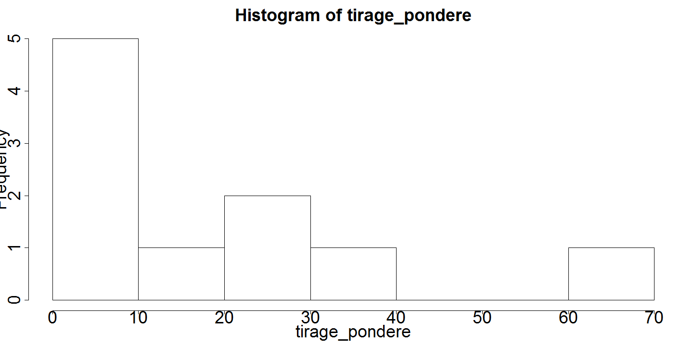

Génération d'aléa - tirage gaussien [rnorm]
========================================================

Il est parfois intéressant de simuler des données. Générons 50 observations tirées d'une variable suivant une loi normale de moyenne 20 et d'écart-type 10.
 

```r
set.seed(123) # permet de reproduire les mêmes résultats d'une fois sur l'autre en dépit de l'aléa présent
n <- 50
Y <- rnorm(n,20,5)

mean(Y) # moyenne empirique
```

```
[1] 20.17202
```

```r
sd(Y) # écart-type empirique
```

```
[1] 4.62935
```

```r
sd(Y)/sqrt(length(Y)) # écart-type de la moyenne empirique
```

```
[1] 0.6546889
```

```r
summary(Y) # quartiles et moyenne empiriques
```

```
   Min. 1st Qu.  Median    Mean 3rd Qu.    Max. 
  10.17   17.20   19.64   20.17   23.49   30.84 
```
Génération d'aléa - visualisation du tirage [boxplot]
========================================================
On peut représenter graphiquement cette variable 
 

```r
boxplot(Y,cex.lab=3, cex.axis=3, cex.main=3, cex.sub=3,cex=3) # diagramme boîte
```

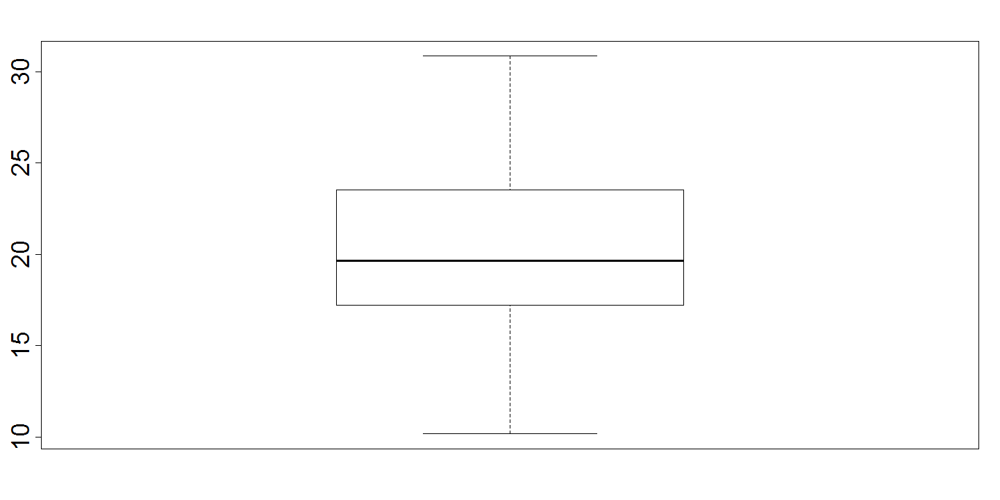


Génération d'aléa - visualisation du tirage [hist & lines & curves]
========================================================

```r
hist(Y, probability=T, col="blue",cex.lab=3, cex.axis=3, cex.main=3, cex.sub=3,cex=3) # histogramme de la densité
lines(density(Y), col="red", lwd=2) # lissage de l'histogramme
# tracer la loi théorique
x <- 1:100
curve(dnorm(x,mean=20,sd=5),add=TRUE,col="green",lwd=2) # l'argument add permet de rajouter cette courbe sur le même graphique, il s'agit de la distribution théorique
```

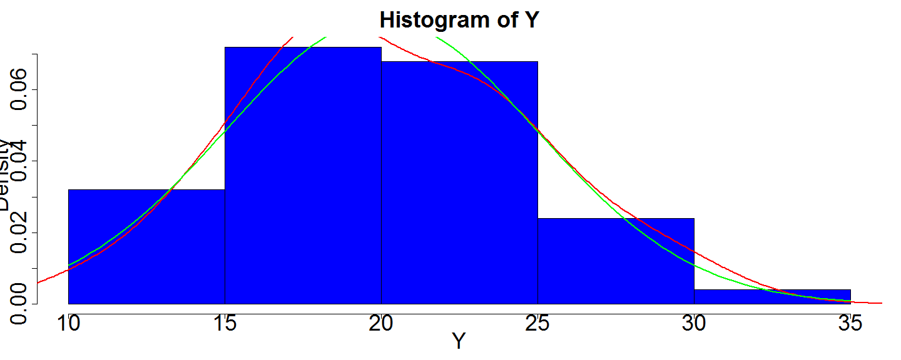

Génération d'aléa - tirage uniforme [runif]
========================================================
On peut générer des observations tirées dans une loi uniforme sur [a,b]
 

```r
X <- runif(n,50,100)
hist(X,cex.lab=3, cex.axis=3, cex.main=3, cex.sub=3,cex=3)
```

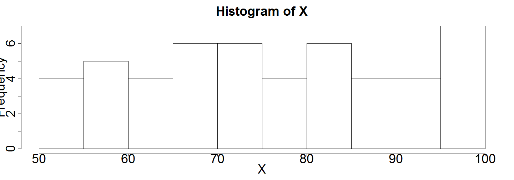

Vous pouvez augmenter la valeur de `n` pour voir ce que ça donne 

Statistiques descriptives sur des données d'hôpitaux Oakland, USA
========================================================
type:section


Exercice sur des données - Introduction
========================================================

Pour cette entrée en matière de l'exploration d'un vrai fichier de donnée, nous nous sommes fortement inspirés de l'exercice suivant https://www.math.univ-toulouse.fr/~besse/Wikistat/pdf/st-scenar-statlab.pdf

Une  étude réalisée  entre  1961  et  1973  dans  la  maternité  d'un  hôpital d'Oakland  (Californie)  avait  pour  but  de  rechercher  si  certaines  caractéristiques  des  parents  avaient  une  influence  sur  le  développement  de  l'enfant. Parmi les variables collectées, 19 variables décrites dans le tableau ci-dessous ont  été  observées  sur  115  familles  ou  unités  statistiques.  Ces  variables  décrivent des informations médicales et socio-économiques concernant le bébé et ses parents au moment de la naissance puis dix ans plus tard, permettant ainsi de se poser différentes questions de nature plutôt épidémiologique :

-  Influence ou non de la consommation de cigarettes sur le sexe de l'enfant, sur son poids, sur sa taille,
-  sur l'évolution du poids de la mère en 10 ans,
-  sur les liaisons entre les caractéristiques des parents (poids, taille, rhésus) et celles de leur enfant

Exercice sur des données - Introduction
========================================================
<center>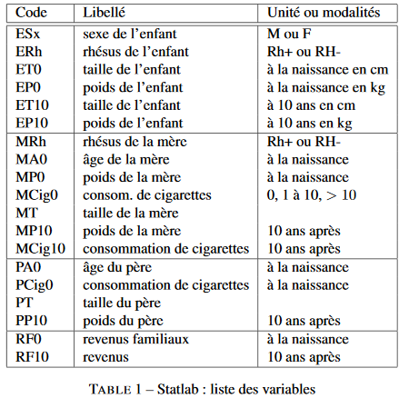</center>

Chargement de données [read.csv2]
========================================================

```r
famil=read.csv2("statlab.csv") # lecture du fichier csv
head(famil) # aperçu du haut des données
```

```
  ESx ERh  ET0  EP0  ET10 EP10 MRh MA0  MP0   MCig0    MT MP10  MCig10 PA0
1   M  R+ 49.5 3.18 136.0 39.9  R+  18 61.0  >10cig 157.0 56.0    0cig  26
2   M  R- 48.5 2.45 124.5 23.1  R-  18 45.0  >10cig 164.5 48.5 1-10cig  22
3   M  R- 51.5 3.31 130.5 26.3  R-  20 55.0 1-10cig 157.5 60.0    0cig  21
4   M  R+ 47.0 3.40 128.5 27.2  R+  20 63.5  >10cig 166.0 65.5  >10cig  20
5   M  R+ 51.0 2.86 133.0 29.9  R+  20 46.5 1-10cig 162.5 54.5    0cig  21
6   M  R+ 51.0 2.90 137.0 33.6  R+  20 46.5  >10cig 162.0 55.0 1-10cig  22
    PCig0    PT PP10 RF0 RF10
1  >10cig 182.5 89.0  42  112
2  >10cig 178.0 66.0  37  140
3  >10cig 180.5 75.0  54  114
4  >10cig 180.5 86.0  86  180
5  >10cig 179.0 68.0  89  150
6 1-10cig 167.5 68.5  96  126
```

Aperçu des données [summary & dim]
========================================================

```r
dim(famil) # combien de colonnes et de ligne 
```

```
[1] 115  19
```

```r
summary(famil) # quelques statistiques classiques
```

```
 ESx    ERh          ET0             EP0             ET10      
 F:46   R-:22   Min.   :43.00   Min.   :1.770   Min.   :124.0  
 M:69   R+:93   1st Qu.:51.00   1st Qu.:2.925   1st Qu.:132.5  
                Median :52.00   Median :3.360   Median :136.0  
                Mean   :51.93   Mean   :3.389   Mean   :136.0  
                3rd Qu.:53.50   3rd Qu.:3.760   3rd Qu.:139.8  
                Max.   :58.50   Max.   :6.350   Max.   :151.5  
      EP10       MRh          MA0             MP0             MCig0   
 Min.   :23.10   R-:19   Min.   :15.00   Min.   : 43.50   >10cig :39  
 1st Qu.:27.45   R+:96   1st Qu.:24.00   1st Qu.: 51.50   0cig   :48  
 Median :31.80           Median :27.00   Median : 56.50   1-10cig:28  
 Mean   :32.53           Mean   :27.53   Mean   : 59.57               
 3rd Qu.:36.05           3rd Qu.:32.00   3rd Qu.: 63.25               
 Max.   :57.20           Max.   :43.00   Max.   :113.50               
       MT             MP10            MCig10        PA0       
 Min.   :148.5   Min.   : 38.50   >10cig :39   Min.   :20.00  
 1st Qu.:160.2   1st Qu.: 55.25   0cig   :55   1st Qu.:26.00  
 Median :164.0   Median : 61.00   1-10cig:21   Median :29.00  
 Mean   :164.1   Mean   : 64.07                Mean   :30.57  
 3rd Qu.:167.8   3rd Qu.: 69.25                3rd Qu.:35.00  
 Max.   :178.0   Max.   :115.50                Max.   :50.00  
     PCig0          PT             PP10             RF0       
 >10cig :65   Min.   :158.0   Min.   : 49.50   Min.   : 14.0  
 0cig   :36   1st Qu.:172.8   1st Qu.: 72.50   1st Qu.: 54.0  
 1-10cig:14   Median :179.0   Median : 80.50   Median : 72.0  
              Mean   :179.0   Mean   : 82.23   Mean   : 76.1  
              3rd Qu.:185.5   3rd Qu.: 90.50   3rd Qu.: 93.0  
              Max.   :198.0   Max.   :129.00   Max.   :250.0  
      RF10      
 Min.   : 21.0  
 1st Qu.:110.0  
 Median :150.0  
 Mean   :156.5  
 3rd Qu.:190.0  
 Max.   :500.0  
```
La fonction `summary` fournit déjà beaucoup d'information sur chaque variable. Mais on pourrait réappliquer les fonctions moyenne, écart-type, quantiles, diagramme boîte, histogramme, indépendamment, sur toutes les variables ou certaines en particulier. 

Aperçu des données quanti [sapply & mean]
========================================================

```r
sapply(famil, mean) # les moyennes de chaque variable 
```

```
       ESx        ERh        ET0        EP0       ET10       EP10 
        NA         NA  51.930435   3.388783 136.047826  32.526087 
       MRh        MA0        MP0      MCig0         MT       MP10 
        NA  27.530435  59.573913         NA 164.104348  64.065217 
    MCig10        PA0      PCig0         PT       PP10        RF0 
        NA  30.565217         NA 178.965217  82.234783  76.095652 
      RF10 
156.495652 
```

```r
sapply(famil, function(x) mean(x,na.rm = T)) # les moyennes de chaque variable en ignorant les valeurs manquantes
```

```
       ESx        ERh        ET0        EP0       ET10       EP10 
        NA         NA  51.930435   3.388783 136.047826  32.526087 
       MRh        MA0        MP0      MCig0         MT       MP10 
        NA  27.530435  59.573913         NA 164.104348  64.065217 
    MCig10        PA0      PCig0         PT       PP10        RF0 
        NA  30.565217         NA 178.965217  82.234783  76.095652 
      RF10 
156.495652 
```

```r
sapply(famil, sd) # les écarts type
```

```
       ESx        ERh        ET0        EP0       ET10       EP10 
 0.4920419  0.3950495  2.9793787  0.6767183  6.0244290  6.1476438 
       MRh        MA0        MP0      MCig0         MT       MP10 
 0.3730019  5.8524575 12.9283185  0.7605851  5.5025894 13.3862200 
    MCig10        PA0      PCig0         PT       PP10        RF0 
 0.7082385  6.4673681  0.7032669  7.7521140 13.6865476 36.1429845 
      RF10 
72.5150165 
```

Aperçu des données quanti [sapply & sd]
========================================================

```r
sapply(famil, sd) # les écarts type
```

```
       ESx        ERh        ET0        EP0       ET10       EP10 
 0.4920419  0.3950495  2.9793787  0.6767183  6.0244290  6.1476438 
       MRh        MA0        MP0      MCig0         MT       MP10 
 0.3730019  5.8524575 12.9283185  0.7605851  5.5025894 13.3862200 
    MCig10        PA0      PCig0         PT       PP10        RF0 
 0.7082385  6.4673681  0.7032669  7.7521140 13.6865476 36.1429845 
      RF10 
72.5150165 
```


Visualisation Univariée quanti [boxplot]
========================================================

```r
boxplot(famil$ET0,cex.lab=3, cex.axis=3, cex.main=3, cex.sub=3,cex=3) # taille de l'enfant
```

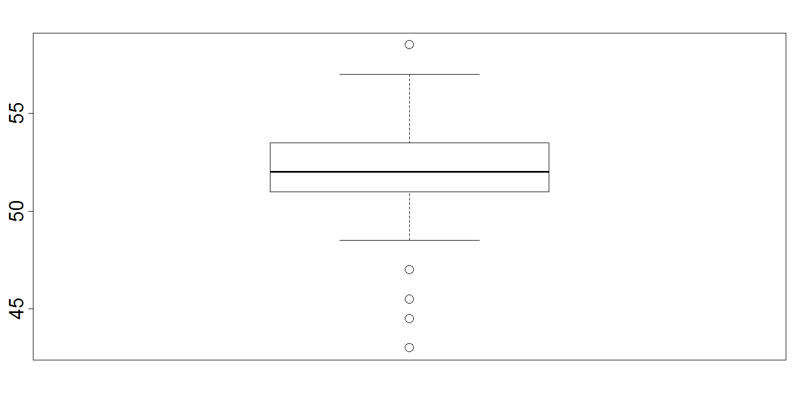

Visualisation Univariée quanti [hist]
========================================================


```r
hist(famil$EP0,cex.lab=3, cex.axis=3, cex.main=3, cex.sub=3,cex=3)# poids de l'enfant
```

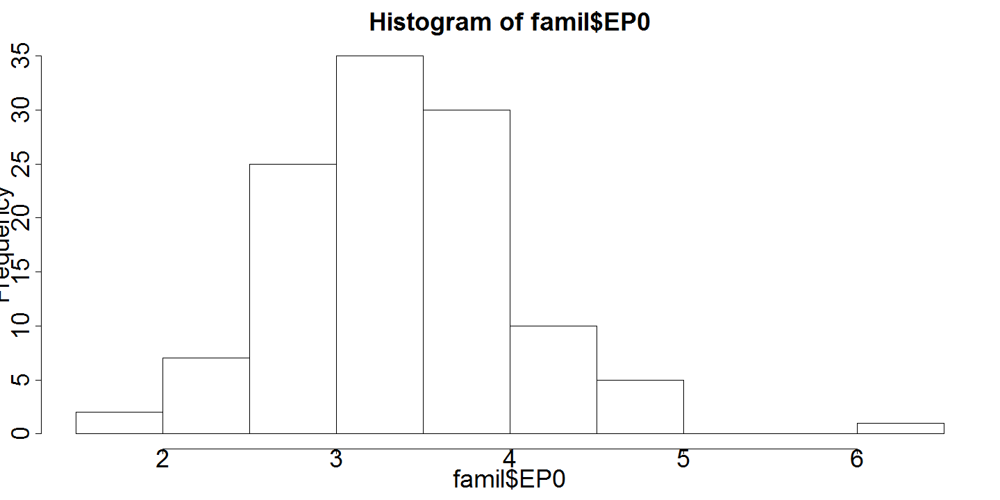


Visualisation Univariée quali [table & barplot]
========================================================
Pour les variables qualitatives, on aura plutôt tendance à considérer les fréquences des modalités.


```r
table(famil$ESx)
```

```

 F  M 
46 69 
```

```r
barplot(table(famil$ESx),cex.lab=3, cex.axis=3, cex.main=3, cex.sub=3,cex=3) # sexe de l'enfant
```

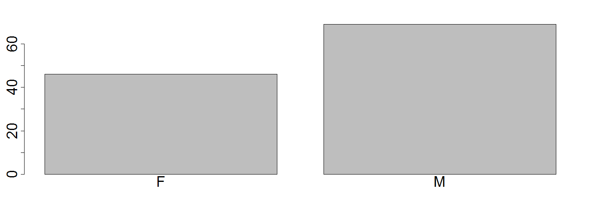

Visualisation Univariée quali [hist]
========================================================
Pour les variables qualitatives, on aura plutôt tendance à considérer les fréquences des modalités.


```r
barplot(table(famil$MCig0),cex.lab=3, cex.axis=3, cex.main=3, cex.sub=3,cex=3) # consommation de cigarettes
```

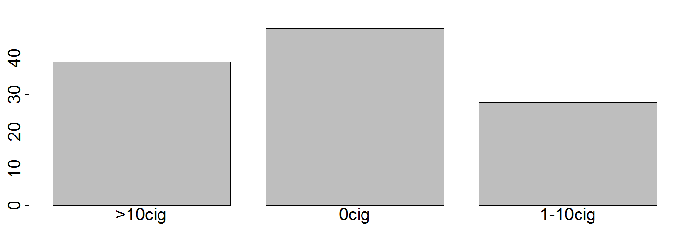

Visualisation Univariée quali [pie]
========================================================
Pour les variables qualitatives, on aura plutôt tendance à considérer les fréquences des modalités.


```r
pie(table(famil$MCig10),cex.lab=3, cex.axis=3, cex.main=3, cex.sub=3,cex=3) # consommation de cigarettes dix ans après 
```


Visualisation Bivariée quanti [pairs]
========================================================

Pour analyser grossièrement les liaisons, on peut regarder un nuage de points 


```r
pairs(famil[,c(3:6,8,9,11)],cex.lab=3, cex.axis=3, cex.main=3, cex.sub=3,cex=3)
```

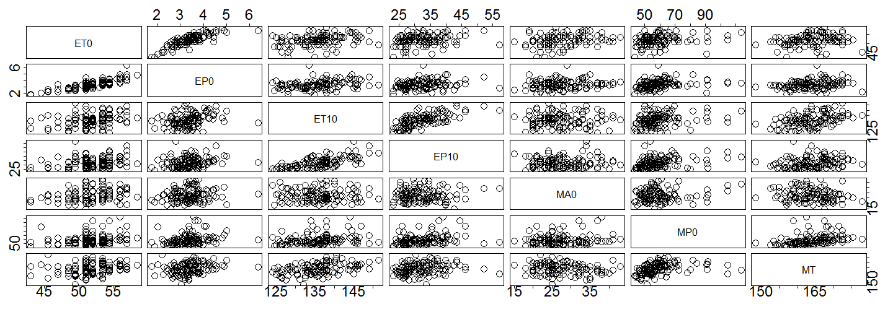

Visualisation Bivariée quanti [plot]
========================================================


```r
plot(EP10~PP10,data=famil,cex.lab=3, cex.axis=3, cex.main=3, cex.sub=3,cex=3) # poids de l'enfant à 10 ans, poids du père
```

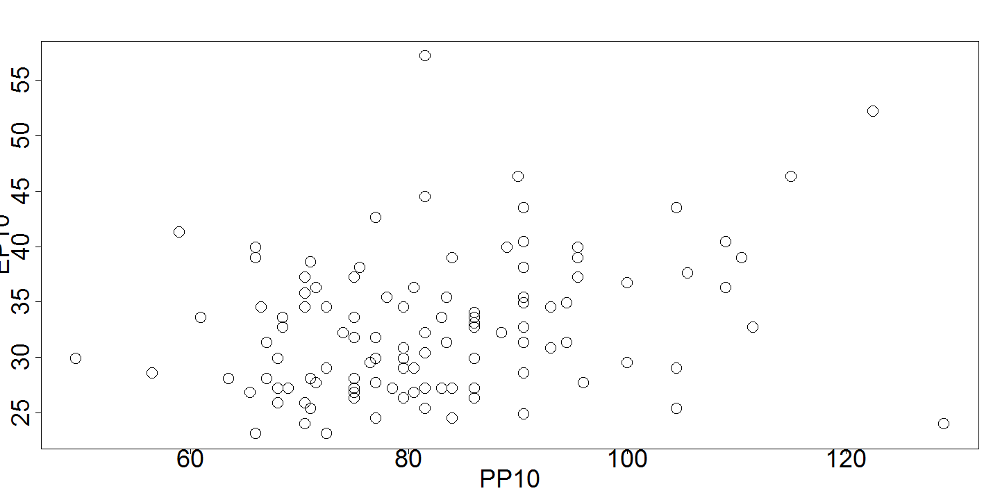
Visualisation Bivariée quanti [plot & lm & abline]
========================================================

On peut facilement ajouter la droite de regression


```r
plot(EP10~ET10,data=famil,cex.lab=3, cex.axis=3, cex.main=3, cex.sub=3,cex=3) # poids de l'enfant à 10 ans, taille à 10 ans
abline(lm(EP10 ~ ET10,data = famil),cex.lab=3, cex.axis=3, cex.main=3, cex.sub=3,cex=3)
```

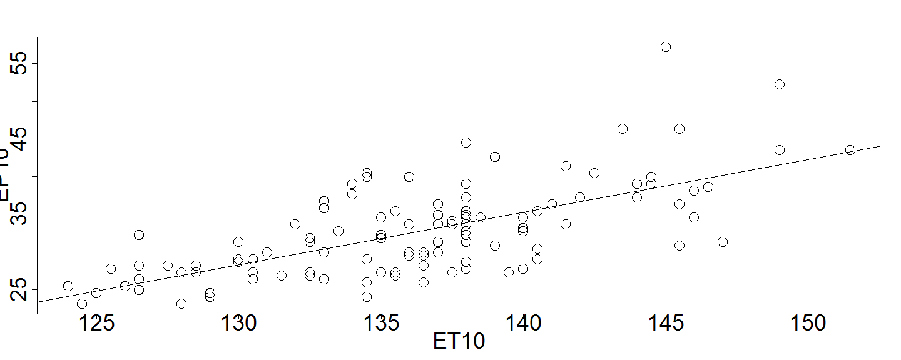

Analyse Bivariée quali [table & addmargins]
========================================================

Pour analyser grossièrement les liaisons entre variables qualitatives, on aura recours aux tables de contingence 


```r
table(famil$ESx,famil$ERh) # sexe et rhésus
```

```
   
    R- R+
  F  9 37
  M 13 56
```

```r
addmargins(table(famil$ESx,famil$ERh)) # avec les marges
```

```
     
       R-  R+ Sum
  F     9  37  46
  M    13  56  69
  Sum  22  93 115
```

Visualisation Bivariée quali [mosaicplot]
========================================================
Une manière de représenter graphiquement ces tables est d'utiliser une moisaique


```r
prop.table(table(famil$ESx,famil$ERh)) # fréquences relatives
```

```
   
            R-         R+
  F 0.07826087 0.32173913
  M 0.11304348 0.48695652
```

```r
mosaicplot(table(famil$ESx,famil$ERh),cex.lab=3, cex.axis=3, cex.main=3, cex.sub=3,cex=3)
```

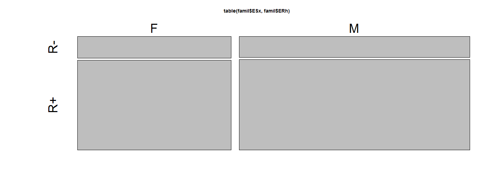


Visualisation Bivariée quali [mosaicplot]
========================================================


```r
addmargins(table(famil$MCig0,famil$ESx)) # consommation de cigarette et sexe de l'enfant
```

```
         
            F   M Sum
  >10cig   11  28  39
  0cig     27  21  48
  1-10cig   8  20  28
  Sum      46  69 115
```

```r
mosaicplot(table(famil$MCig0,famil$ESx),cex.lab=3, cex.axis=3, cex.main=3, cex.sub=3,cex=3)
```

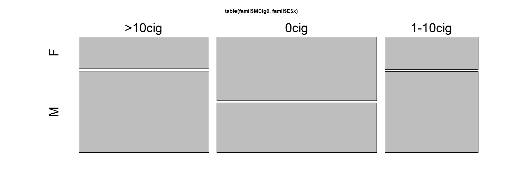

Visualisation Bivariée quali x quanti [boxplot]
========================================================

Si l'on veut croiser variables qualitatives et quantitatives, on peut utiliser les boites 


```r
boxplot(EP0~ESx,data=famil,cex.lab=3, cex.axis=3, cex.main=3, cex.sub=3,cex=3) # poids de l'enfant vs sexe
```

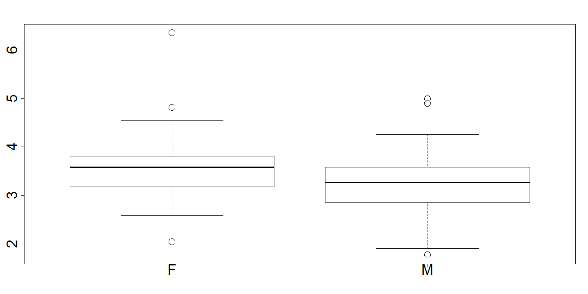

Visualisation Bivariée quali x quanti [boxplot]
========================================================


```r
boxplot(EP0~MCig0,data=famil,cex.lab=3, cex.axis=3, cex.main=3, cex.sub=3,cex=3) # poids de l'enfant vs consommation de cigarettes
```

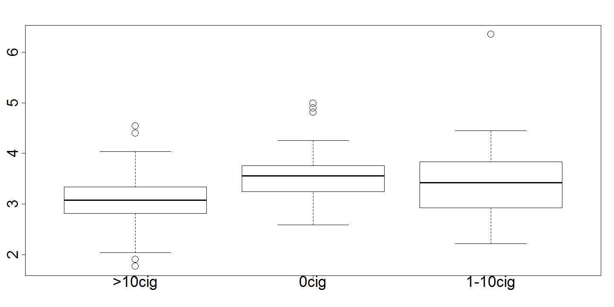

Manipulation des données - ordre des modalités
========================================================
Remarque, les modalités de `Mcig0` ne sont pas dans l'ordre le plus naturel, on peut décider de réordonner les modalités.


```r
famil$MCig0 <- factor(famil$MCig0, levels = c("0cig", "1-10cig", ">10cig"))

famil$MCig10 <- factor(famil$MCig10, levels = c("0cig", "1-10cig", ">10cig"))
boxplot(EP0~MCig0,data=famil,cex.lab=3, cex.axis=3, cex.main=3, cex.sub=3,cex=3) # poids de l'enfant vs consommation de cigarettes
```

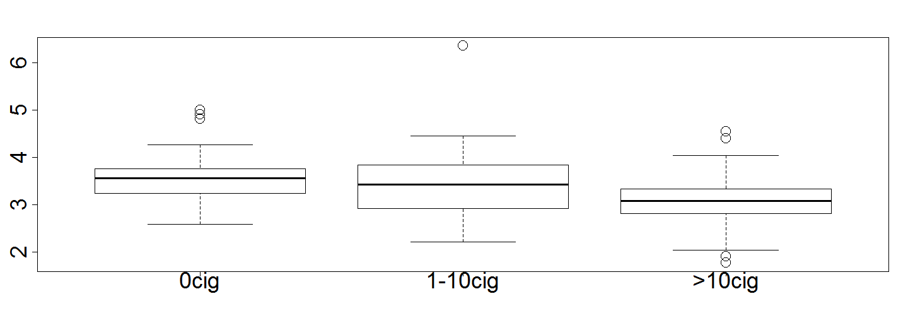

Test de liaison
========================================================
type:section

Test de liaison [chisq.test]
========================================================

Quelques tests, imaginons qu'on veuille tester l'indépendance de deux variables qualitatives. Le test du $\chi^2$ sera adapté à ce problème (dans le cas 
où les effectifs d'une modalité sont trop faibles, il faut regrouper les modalités). 


```r
chisq.test(table(famil$ESx,famil$ERh)) # Sexe de l'enfant vs Rhésus
```

```

	Pearson's Chi-squared test with Yates' continuity correction

data:  table(famil$ESx, famil$ERh)
X-squared = 5.6549e-31, df = 1, p-value = 1
```

```r
chisq.test(table(famil$ESx,famil$MCig0)) # Sexe de l'enfant vs consommation de cigarettes
```

```

	Pearson's Chi-squared test

data:  table(famil$ESx, famil$MCig0)
X-squared = 9.0657, df = 2, p-value = 0.01075
```

Test de liaison [shapiro.test]
========================================================
On s'intéresse à l'influence du sexe sur la taille à la naissance. Tester l'égalité des deux moyennes nécessite de vérifier préalablement plusieurs points : la normalité des distributions dans chaque classe à moins que l'échantillon soit considéré de taille suffisamment grande, le caractère indépendant ou appariés des échantillons, l'égalité ou non des variances à l'intérieur de chaque groupe. On dispose de deux échantillons indépendants : les garçons et les filles. Testons les autres hypothèses.


```r
# Normalité des distributions (facultatif car n grand ici)
shapiro.test(famil[famil$ESx=="M","ET0"]) 
```

```

	Shapiro-Wilk normality test

data:  famil[famil$ESx == "M", "ET0"]
W = 0.95676, p-value = 0.01779
```

```r
shapiro.test(famil[famil$ESx=="F","ET0"])
```

```

	Shapiro-Wilk normality test

data:  famil[famil$ESx == "F", "ET0"]
W = 0.95141, p-value = 0.05315
```

Test de liaison [var.test]
========================================================
On s'intéresse à l'influence du sexe sur la taille à la naissance. Tester l'égalité des deux moyennes nécessite de vérifier préalablement plusieurs points : la normalité des distributions dans chaque classe à moins que l'échantillon soit considéré de taille suffisamment grande, le caractère indépendant ou appariés des échantillons, l'égalité ou non des variances à l'intérieur de chaque groupe. On dispose de deux échantillons indépendants : les garçons et les filles. Testons les autres hypothèses.


```r
# égalité des variances (test de Fisher)
var.test(ET0~ESx,data=famil)
```

```

	F test to compare two variances

data:  ET0 by ESx
F = 0.92761, num df = 45, denom df = 68, p-value = 0.7979
alternative hypothesis: true ratio of variances is not equal to 1
95 percent confidence interval:
 0.5495201 1.6132113
sample estimates:
ratio of variances 
         0.9276114 
```

Test de liaison [t.test]
========================================================
Le test de comparaison des moyennes à utiliser (Student vs. Welsh) dépend du résultat précédent concernant l'égalité des variances.


```r
t.test(ET0~ESx,var.equal=F, data=famil) # si les variances sont différentes c'est un test de Welsh
```

```

	Welch Two Sample t-test

data:  ET0 by ESx
t = 2.9017, df = 99.064, p-value = 0.004573
alternative hypothesis: true difference in means is not equal to 0
95 percent confidence interval:
 0.5006535 2.6660131
sample estimates:
mean in group F mean in group M 
       52.88043        51.29710 
```

Test de liaison [t.test]
========================================================
Le test de comparaison des moyennes à utiliser (Student vs. Welsh) dépend du résultat précédent concernant l'égalité des variances.


```r
t.test(ET0~ESx,var.equal=T, data=famil) # Dans le cas où elles sont considérées égales, c'est un test de Student.
```

```

	Two Sample t-test

data:  ET0 by ESx
t = 2.8798, df = 113, p-value = 0.004761
alternative hypothesis: true difference in means is not equal to 0
95 percent confidence interval:
 0.4940799 2.6725868
sample estimates:
mean in group F mean in group M 
       52.88043        51.29710 
```

Test de liaison [t.test]
========================================================
Dans le cas d'échantillons appariés, par exemple si on se propose d'étudier l'évolution du poids de la mère au moment de la naissance et dix ans après, on utilise l'option `paired=TRUE`


```r
t.test(famil$MP0, famil$MP10,paired=TRUE)
```

```

	Paired t-test

data:  famil$MP0 and famil$MP10
t = -7.458, df = 114, p-value = 1.864e-11
alternative hypothesis: true difference in means is not equal to 0
95 percent confidence interval:
 -5.684285 -3.298324
sample estimates:
mean of the differences 
              -4.491304 
```

Test de liaison - Remarques
========================================================

- si l'hypothèse de normalité des distributions n'est pas vérifiée et si l'échantillon est trop réduit, c'est un test non-paramétrique qu'il faut mettre en ouvre. Les tests non-paramétriques sont basés sur les rangs des observations et donc sur les comparaisons des médianes des échantillons (wilcoxson). 

- Si l'on veut tester l'indépendance entre une variable qualitative et quantitative, l'ANOVA associée à un test de Fisher est sans doute le test le plus utilisé ; il revient au test de Student lorsque la variable qualitative n'a que deux modalités.

Régression Linéaire
========================================================
type:section

Régression linéaire - modèle [lm]
========================================================
La régression simple permet de tester l'influence éventuelle d'une variable sur une autre et plus précisément, dans le cas de cet exemple, d'expliquer la taille  de  l'enfant  à  10  ans. On estime le modèle avec la fonction `lm`  


```r
res1.reg <- lm(ET10 ~ PT, data = famil)
names(res1.reg) # liste des résultats
```

```
 [1] "coefficients"  "residuals"     "effects"       "rank"         
 [5] "fitted.values" "assign"        "qr"            "df.residual"  
 [9] "xlevels"       "call"          "terms"         "model"        
```

Régression linéaire - Visualisation [qqnorm & qqline]
========================================================
Les graphiques suivants permettent de s'assurer de la validité du modèle, et notamment de statuer sur l'homoscédasticité des résidus, leur normalité, la bonne linéarité du modèle.


```r
qqnorm(res1.reg$residuals) # normalité des résidus
qqline(res1.reg$residuals)
```

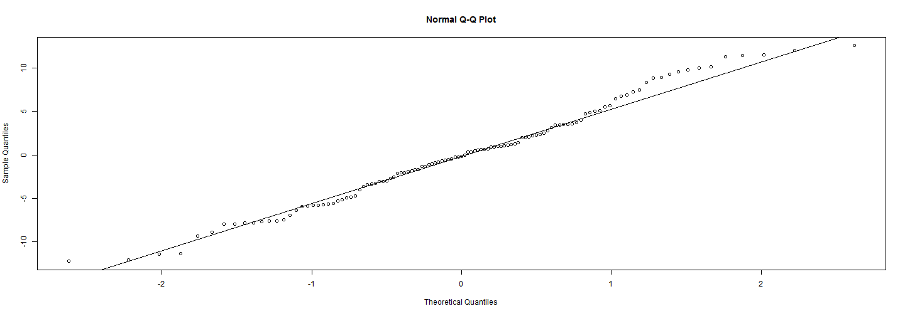


Régression linéaire [shapiro.test]
========================================================


```r
shapiro.test(res1.reg$residuals) 
```

```

	Shapiro-Wilk normality test

data:  res1.reg$residuals
W = 0.98511, p-value = 0.2346
```

Régression linéaire [rstudent]
========================================================
Les résidus sont "grands" si, une fois normalisés ou plutôt "studentisés", ils sont de valeur absolue plus grande que 2. 


```r
res.student <- rstudent(res1.reg)
ychap=res1.reg$fitted.values
plot(res.student~ychap,ylab="Résidus",cex.lab=3, cex.axis=3, cex.main=3, cex.sub=3,cex=3) 
abline(h=c(-2,0,2),lty=c(2,1,2)) # rajoute une ligne horizontale
```

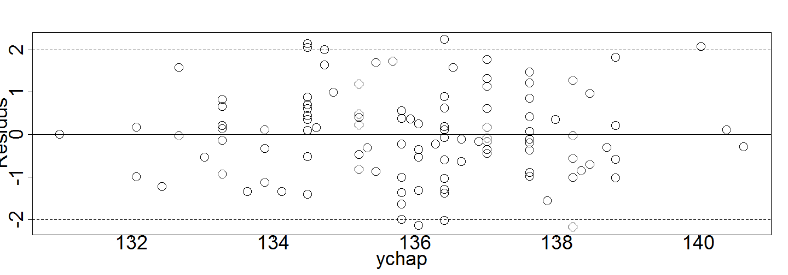

Régression linéaire [cook.distance]
========================================================
Une observation est influente si elle a un grand résidu est est associée à une grande valeur sur la diagonale de la hat matrix. Cela correspond à une valeur élevée (plus grande que 1) de la distance de Cook.


```r
cook <- cooks.distance(res1.reg) # repérage de points influents
plot(cook~ychap,ylab="Distance de Cook",cex.lab=3, cex.axis=3, cex.main=3, cex.sub=3,cex=3)
abline(h=c(0,1),lty=c(1,2))
```

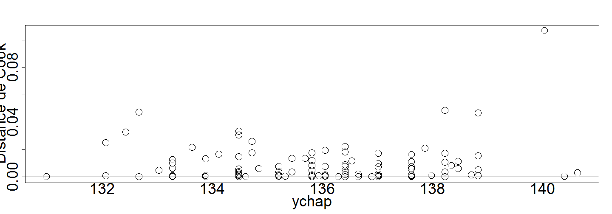

Régression linéaire - significativité [summary]
========================================================

La significativité du modèle peut être analysée via la fonction `summary` : 


```r
summary(res1.reg)
```

```

Call:
lm(formula = ET10 ~ PT, data = famil)

Residuals:
     Min       1Q   Median       3Q      Max 
-12.2297  -3.8156  -0.1753   3.4956  12.5815 

Coefficients:
            Estimate Std. Error t value Pr(>|t|)    
(Intercept) 92.82881   12.44735   7.458 1.94e-11 ***
PT           0.24149    0.06949   3.475 0.000725 ***
---
Signif. codes:  0 '***' 0.001 '**' 0.01 '*' 0.05 '.' 0.1 ' ' 1

Residual standard error: 5.751 on 113 degrees of freedom
Multiple R-squared:  0.09657,	Adjusted R-squared:  0.08857 
F-statistic: 12.08 on 1 and 113 DF,  p-value: 0.0007246
```

Régression linéaire multivarié - significativité [plot]
========================================================
La régression linéaire simple conduit à un modèle très mal ajusté. Le modèle linéaire multiple ci-dessous, plus complexe, recherche un meilleur ajustement des données.


```r
res2.reg <- lm(ET10~ET0+EP0+MA0+MP0+MT+MP10+PA0+PT+PP10+RF0+RF10, data = famil)
plot(res2.reg) # diagnostics des résidus
```

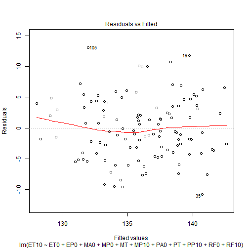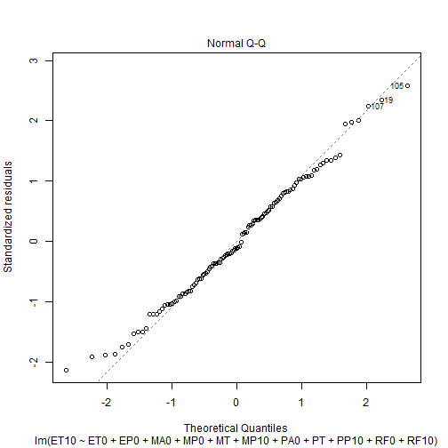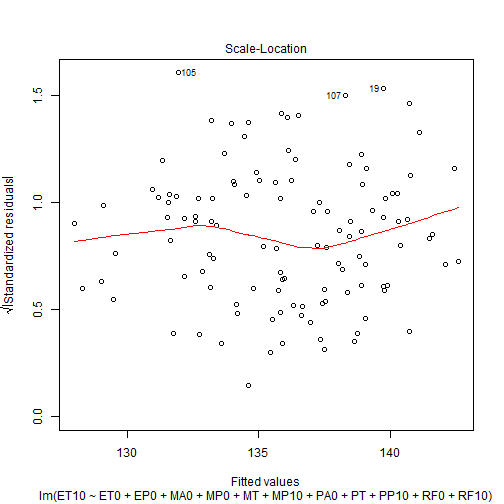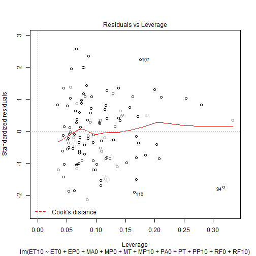

Régression linéaire multivarié - significativité [summary]
========================================================


```r
summary(res2.reg) # résultats 
```

```

Call:
lm(formula = ET10 ~ ET0 + EP0 + MA0 + MP0 + MT + MP10 + PA0 + 
    PT + PP10 + RF0 + RF10, data = famil)

Residuals:
    Min      1Q  Median      3Q     Max 
-10.753  -3.605  -0.583   3.575  13.055 

Coefficients:
             Estimate Std. Error t value Pr(>|t|)   
(Intercept) 19.395052  22.732841   0.853  0.39554   
ET0          0.603298   0.293976   2.052  0.04269 * 
EP0         -1.024211   1.330923  -0.770  0.44333   
MA0         -0.070042   0.149033  -0.470  0.63937   
MP0         -0.066802   0.082435  -0.810  0.41961   
MT           0.346222   0.107974   3.207  0.00179 **
MP10         0.078521   0.079884   0.983  0.32794   
PA0          0.147236   0.130401   1.129  0.26148   
PT           0.154598   0.089309   1.731  0.08644 . 
PP10         0.035471   0.050199   0.707  0.48140   
RF0         -0.007751   0.016938  -0.458  0.64819   
RF10        -0.010480   0.008614  -1.217  0.22652   
---
Signif. codes:  0 '***' 0.001 '**' 0.01 '*' 0.05 '.' 0.1 ' ' 1

Residual standard error: 5.245 on 103 degrees of freedom
Multiple R-squared:  0.3152,	Adjusted R-squared:  0.242 
F-statistic: 4.309 on 11 and 103 DF,  p-value: 2.792e-05
```

Analyse en Composantes Principales
========================================================
type:section

Réduction de dimension [ACP]
========================================================
On peut aller plus loin dans l'exploration sur les données sans fixer une variable cible, en réalisant une analyse en composantes principales. On ne garde que les variables quantitatives.  

Pour cela, on va faire appel à la librairie `prcomp`, ce n'est pas la seule qui permet de faire une ACP. Assez régulièrement sous R, on va avoir besoin de mobiliser des packages ou librairies. La  liste  complète  des packages disponibles gratuitement est consultable sur le site du CRAN. L'installation d'un package supplémentaire peut se faire via le menu Packages>Installer le(s) package(s) et en choisissant un site miroir du CRAN. On peut également télécharger l'archive .zip correspondant au package et utiliser ensuite Packages/Installer depuis des fichiers zip

On peut sinon taper la commande :


```r
# if (!require("factoextra"))install.packages('factoextra') # décommenter pour installer
```

ACP en pratique [prcomp et plot]
========================================================

http://www.sthda.com/french/articles/38-methodes-des-composantes-principales-dans-r-guide-pratique/79-acp-dans-r-prcomp-vs-princomp/


```r
data <- famil[,c(3:6,8,9,11,12,14,16:19)] # liste des varaibles quantitatives
noms <- names(data)
res.pca <- prcomp(data,scale=T)
# plot(res.pca) # décroissance des valeurs propres
factoextra::fviz_eig(res.pca,cex.lab=3, cex.axis=3, cex.main=3, cex.sub=3,cex=3)
```

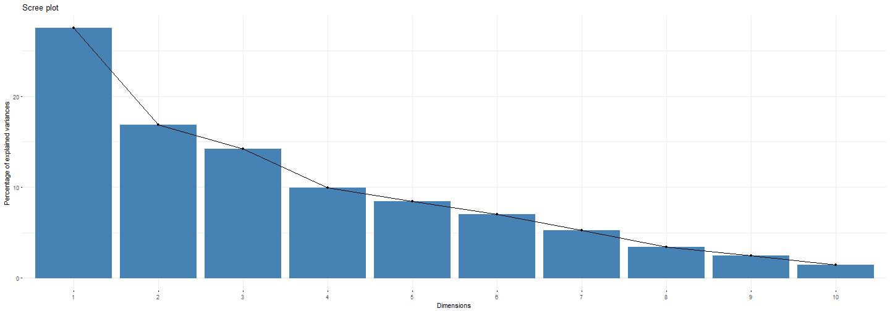


ACP en pratique [summary]
========================================================


```r
summary(res.pca) # parts de variance expliquée
```

```
Importance of components:
                          PC1    PC2    PC3     PC4     PC5     PC6
Standard deviation     1.8915 1.4792 1.3594 1.13565 1.04918 0.95572
Proportion of Variance 0.2752 0.1683 0.1422 0.09921 0.08468 0.07026
Cumulative Proportion  0.2752 0.4435 0.5857 0.68488 0.76956 0.83982
                           PC7     PC8     PC9    PC10   PC11    PC12
Standard deviation     0.82493 0.66919 0.56744 0.43219 0.4281 0.39240
Proportion of Variance 0.05235 0.03445 0.02477 0.01437 0.0141 0.01184
Cumulative Proportion  0.89217 0.92661 0.95138 0.96575 0.9798 0.99169
                          PC13
Standard deviation     0.32870
Proportion of Variance 0.00831
Cumulative Proportion  1.00000
```

ACP en pratique [plot & text & abline]
========================================================


```r
plot(res.pca$x,col=c('black','red','green')[famil$MCig0],cex.lab=3, cex.axis=3, cex.main=3, cex.sub=3,cex=3) # les observations sont représentées dans le plan des deux composantes principales résumant le mieux l'information contenue dans les données, la couleur permet de distinguer la consommation de cigarette (noir pour la consommation la plus élevée) 
text(10*res.pca$rotation,noms,col="blue") # on peut afficher également les variables pour interpréter les axes, on voit que l'axe vertical rend surtout compte des revenus tandis que l'axe horizontal est plus lié à la taille et au poids de l'enfant et des parents. 
abline(h=0,v=0,lty=2)
```

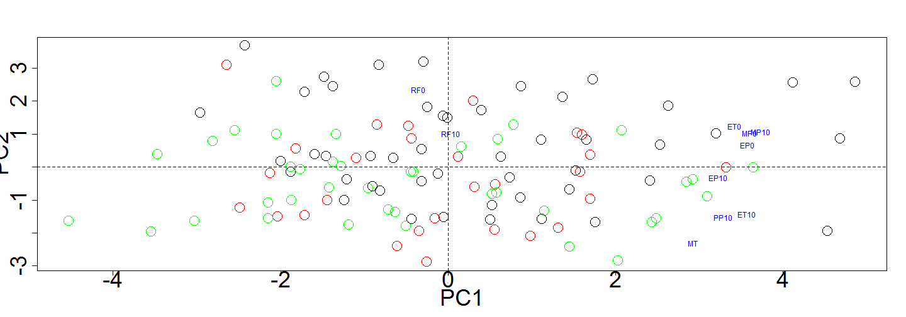

ACP en pratique - individus sur PC1 & PC2
========================================================


```r
factoextra::fviz_pca_ind(res.pca,
             col.ind = "cos2", # Colorer par le cos2
             gradient.cols = c("#00AFBB", "#E7B800", "#FC4E07"),
             repel = TRUE,cex.lab=3, cex.axis=3, cex.main=3, cex.sub=3,cex=3     
             )
```

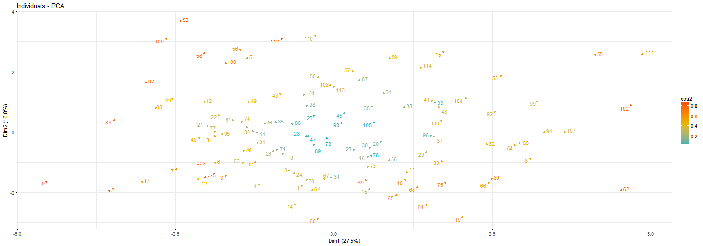

ACP en pratique - variables sur PC1 & PC2
========================================================


```r
factoextra::fviz_pca_var(res.pca,
             col.var = "contrib", 
             gradient.cols = c("#00AFBB", "#E7B800", "#FC4E07"),
             repel = TRUE ,cex.lab=3, cex.axis=3, cex.main=3, cex.sub=3,cex=3    
             )
```

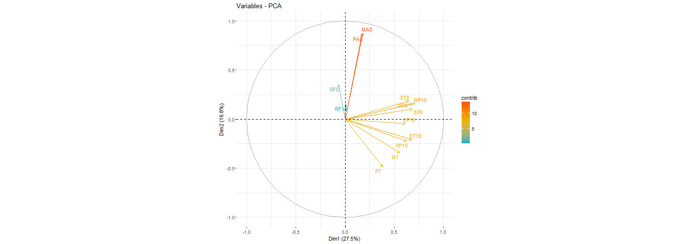

ACP en pratique - biplot sur PC1 & PC2
========================================================

```r
factoextra::fviz_pca_biplot(res.pca, repel = TRUE,
                col.var = "#2E9FDF", 
                col.ind = "#696969"  ,cex.lab=3, cex.axis=3, cex.main=3, cex.sub=3,cex=3
                )
```

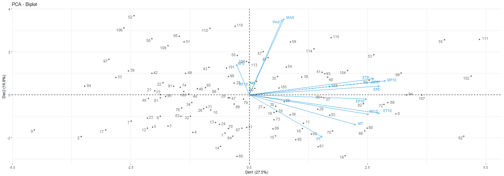

ACP en pratique - ind et groupes sur PC1 & PC2
========================================================

```r
groups <- (factor(data$PA0>30))
levels(groups)<-c("Low","High")
factoextra::fviz_pca_ind(res.pca,
             col.ind = groups, # colorer par groupes
             palette = c("#00AFBB",  "#FC4E07"),
             addEllipses = TRUE, # Ellipse de concentration
             ellipse.type = "confidence",
             legend.title = "Groups",
             repel = TRUE,cex.lab=3, cex.axis=3, cex.main=3, cex.sub=3,cex=3
             )
```

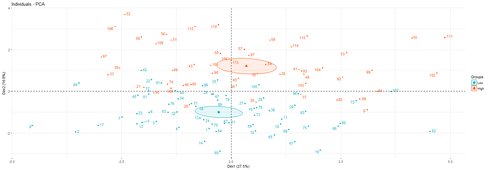


Exercice d'application sur des données d'urgences
========================================================
type:section


Exploration des données d'urgence - Intro
========================================================
Cet exercice mobilise l'enquête nationale sur les structures des urgences hospitalières 2013. Un jour donné, le 11 juin 2013 de 8h à 8h le 
lendemain, un questionnaire papié renseigné en temps réel en parallèle de la prise en charge par tous les points d'accueils (736) des établissements de santé autorisés pour l'activité d'accueil et de traitement des urgences (634) et pour tous les patients (52018). 

Exploration des données d'urgence - Chargement [csv] et aperçu
========================================================

```r
urgences <- read.csv2("enq_urgences_structure.csv", sep=',') # lecture du fichier csv
head(urgences,2) # aperçu du début des données
```

```
  id_point_d_accueil                       ID_A1     ID_A2
1        010008407G1            CH DU HAUT BUGEY 010005239
2        010780054G1 CH FLEYRIAT BOURG-EN-BRESSE 010780054
                              ID_A4 ID_A6 ID_A7 ID_A8 ID_A9 ID_A10 ID_A11
1 Structures des urgences générales     0     1     0     0      1      0
2 Structures des urgences générales     1     1     1     1      1      1
  ID_A12                   ID_A13 ID_A14 ID_A15 ID_A16 ID_A17 ID_A18
1      0                               0             3      3      1
2      0 Toutes les unités de MCO      0             3      3      1
  ID_A19
1      0
2      1
                                                                    ID_A20
1                                                                         
2 Réseau RESUVAL : Etude présence par un ARC, harmonisation des protocoles
  ID_A21 ID_A22 ID_A23 ID_A24 ID_A25 ID_B25 ID_C25 ID_D25 ID_E25 ID_F25
1      0     NA     NA     NA      9   8.50   4.00   0.00     NA      0
2      1      1      1      0     19  19.05   0.00   0.25   3161      0
  ID_A26 ID_B26 ID_C26 ID_D26 ID_E26 ID_F26 ID_A27 ID_B27 ID_C27 ID_D27
1      0   0.00                   NA     NA      0   0.00              
2      0   0.00                   NA     NA      8   7.66              
  ID_E27 ID_F27 ID_A28 ID_B28 ID_C28 ID_D28 ID_E28 ID_F28 ID_A29 ID_B29
1     NA     NA      1   1.00                   NA     NA     21  19.85
2     NA     NA      2   2.00   0.00   0.00     NA     NA     38  35.82
  ID_C29 ID_D29 ID_E29 ID_F29 ID_A30 ID_B30 ID_C30 ID_D30 ID_E30 ID_F30
1                   NA     NA     15  15.00                   NA     NA
2                   NA     NA     18  15.75                   NA     NA
  ID_A31 ID_B31 ID_C31 ID_D31 ID_E31 ID_F31 ID_A32 ID_B32 ID_C32 ID_D32
1      0   0.00                   NA     NA      1   0.50              
2      3   3.00                   NA     NA      4   4.00              
  ID_E32 ID_F32 ID_A33 ID_B33 ID_C33 ID_D33 ID_E33 ID_F33 ID_A34 ID_B34
1     NA     NA      0   0.00                   NA     NA      0   0.00
2     NA     NA      0   0.00                   NA     NA     10   9.85
  ID_C34 ID_D34 ID_E34 ID_F34 ID_A35 ID_A36 ID_A37        ID_A38 ID_A39
1                   NA     NA      0     NA     NA                   NA
2                   NA     NA      1      1      1 Aide-soignant      1
  ID_A40 ID_A41 ID_A42 ID_A43 ID_A44 ID_A45 ID_B45 ID_C45 ID_A46 ID_A47
1     NA      0      0     NA      0     NA     NA     NA      0      1
2     69      0      1      0      0     NA     NA     NA      1      1
  ID_A49 ID_A50 ID_B50 ID_C50 ID_A51 ID_A52 ID_B52 ID_C52 ID_A53 ID_A54
1      0     NA     NA     NA      1      1     NA     NA      0     NA
2      0     NA     NA     NA      1      1     NA      1      0     NA
  ID_A55 ID_A56 ID_A57 ID_A58 ID_A59 ID_A60 ID_A61 ID_A62 ID_A63 ID_A64
1      0      0      0      1      1      1      1      1      1      0
2      1      1      1      1      1      1      1      1      1      1
  ID_A65 ID_A66 ID_A67 ID_A68 ID_A69 ID_A70 ID_A71 ID_A72 ID_A73 ID_A74
1     NA     NA      1     15      0     NA      0      0     NA     NA
2      1      1      1     22      1      4      0      0     NA     NA
  ID_A75 ID_A76 ID_A77 ID_A78 ID_A79 ID_A80 ID_A81 ID_A82 ID_A83 ID_A84
1      0             0      0      0      1      1      0     NA     NA
2      0             1      1      1      1      1      1      2      1
                                                                                          ID_A85
1           programmation des sejours, programmation des sorties, SSR reeducation. DMS améliorée
2 Envoi par mail de l'état des lits disponibles des 2 hôpitaux du département ayant des lits SSR
      ID_A86 ID_A87 ID_B87 ID_C87 ID_D87 ID_E87 ID_A88 ID_B88 ID_C88
1 11/06/2013      1      3      3      8      5      1      0      1
2 11/06/2013      1      6     11      5      2      1      0      1
  ID_D88 ID_E88 ID_A89 ID_B89 ID_C89 ID_D89 ID_E89 ID_A90 ID_B90 ID_C90
1      2      0      6      2      1      0      2      2      2      0
2      2      1      8      5      1      3      8      0      0      0
  ID_D90 ID_E90 ID_A91 ID_B91 ID_C91 ID_D91 ID_E91 ID_A92 ID_B92 ID_C92
1      3      3      0      0      0      0      0      3      3      3
2      0      0      0      1      0      0      1      3      4      4
  ID_D92 ID_E92 ID_A93 ID_B93 ID_C93 ID_D93 ID_E93 ID_A94 ID_B94 ID_C94
1      3      3      0      0      0      0      0      0      0      0
2      3      3      0      0      0      0      0      1      2      1
  ID_D94 ID_E94 ID_A95 ID_B95 ID_C95 ID_D95 ID_E95 ID_A96 ID_B96 ID_C96
1      0      0      0      0      0      0      0      1      1      0
2      1      1      0      0      0      0      0      1      1      1
  ID_D96 ID_E96 ID_A97 ID_B97 ID_C97 ID_D97 ID_E97 ID_A98 ID_B98 ID_C98
1      0      1      2      2      2      2      2      2      2      2
2      1      1      6      6      6      5      6      2      2      2
  ID_D98 ID_E98 ID_A99 ID_B99 ID_C99 ID_D99 ID_E99 ID_A100 ID_B100 ID_C100
1      1      2      0      0      0      0      0       1       1       0
2      1      2      2      2      0      0      2       1       2       1
  ID_D100 ID_E100 ID_A101 ID_B101 ID_C101 ID_D101 ID_E101 ID_A102 ID_B102
1       0       1       0       0       0       0       0       0       0
2       0       1       2       2       2       1       2       1       2
  ID_C102 ID_D102 ID_E102 ID_A103 ID_A104 ID_A105
1       0       0       0      57       0      NA
2       0       0       0     111       6      12
```

```r
dim(urgences) # combien de colonnes et de lignes 
```

```
[1] 734 223
```

```r
#names(urgences)
dim(urgences)
```

```
[1] 734 223
```

Exploration des données d'urgence - Chargement [xls] et aperçu
========================================================
Remarque, si le fichier était au format xls, on pourrait l'ouvrir, par exemple, avec le package `xlsx`

```r
library("xlsx")
urgences2 <- read.xlsx("enq_urgences_structure.xls",1) # 1 correspond ici à la page 1 de l'excel
head(urgences2) # aperçu du haut des données
dim(urgences2)
```


Exploration des données d'urgence - Dictionnaire
========================================================
Pour chaque heure de pointage (8h, 12h, 18h, 22h, 8h) indiquée par les lettres A, B, C, D, E, on retient pour l'exercice les variables suivantes (cf questionnaire dans le dossier de la formation) :

Les variables de présence de patients aux urgences :

- 87 : Nombre de patients en cours d'évaluation, non admis (nombre de patients présents hors lit i.e. box, salle d'attente) pour lesquels une décision d'hospitalisation n'a pas été prise
- 88 : Nombre de patients admis et en attente d'hospitalisation sur un brancard ou un fauteuil roulant (« boarding »)
- 89 : Nombre de patients présents en lit (UHCD) qui ne sont pas en attente d'hospitalisation
- 90 : Nombre de patients présents en lit (UHCD) en attente d'hospitalisation

Exploration des données d'urgence - Dictionnaire
========================================================

Les variables d'organisation du travail : 

- 92 : Nombre de médecins urgentistes
- 93 : Nombre de médecins non urgentistes
- 94 : Nombre d'interne
- 95 : Nombre de médecins intérimaires et extérieurs
- 96 : Nombre de cadres de santé
- 97 : Nombre d'infirmiers diplômés d'État (IDE)
- 98 : Nombre d'aide soignants(AS)
- 99 : Nombre d'agents de service hospitalier (ASH)
- 100 : Nombre de secrétaires 
- 101 : Nombre de brancardiers

Les variables liées à l'établissement :

- A103 : Nombre de passages sur les 24 heures
- A4 : type d'accueil
- A2 : numéro finess de l'établissement

Nettoyage des données
========================================================
Pour ne garder que ces variables là, on reconstruit les noms des variables pour chaque heure de pointage. Par exemple, la variable 98 : nombre d'aide soignant, va être présente cinq fois : "ID_A87", "ID_B87", "ID_C87", "ID_D87", "ID_E87". On va utiliser `lapply` et `paste` (qui concatène les chaines de caractères) pour reconstituer tous les noms de variables qu'on veut garder pour toutes les heures de pointages. `rep` est une fonction qui répète plusieurs fois le même élément.

```r
col_a_garder <- c(87:90,92:101)
nbcol <- length(col_a_garder)
paste(rep('ID_',nbcol),rep('A',nbcol),col_a_garder,sep='') # génère la liste des variables pour la première heure de pointage
```

```
 [1] "ID_A87"  "ID_A88"  "ID_A89"  "ID_A90"  "ID_A92"  "ID_A93"  "ID_A94" 
 [8] "ID_A95"  "ID_A96"  "ID_A97"  "ID_A98"  "ID_A99"  "ID_A100" "ID_A101"
```

```r
col_a_garder <- unlist(lapply(c('A','B','C','D','E'), function(lettre) paste(rep('ID_',nbcol),rep(lettre,nbcol),col_a_garder,sep=''))) # génère les 5 listes de variables en une seule ligne de code
col_a_garder <- c(col_a_garder, "ID_A103","ID_A4","ID_A2")
urgences <- urgences[,col_a_garder]
dim(urgences)
```

```
[1] 734  73
```

Répartition des types d'établissement
========================================================


```r
table(urgences$ID_A4) # répartition des structures
```

```

                                                             Structures des urgences générales 
                                                                                           536 
Structures des urgences générales sur site ayant aussi une structure des urgences pédiatriques 
                                                                                            94 
                                                          Structures des urgences pédiatriques 
                                                                                           104 
```


Distribution des volumes de passages
========================================================
On va regarder la distribution du nombre de passages total dans les établissements, c'est un proxy de la taille de ces derniers. On va créer des modalités pour identifier les services d'urgences comparables. Pour les graphiques, on va désormais utiliser la librairie `ggplot2`, installez-là si elle n'est pas installée. `aes` permet de définir les variables qui vont être utilisées.


```r
library(ggplot2)
ggplot(urgences, aes(x=ID_A103)) + geom_histogram(fill="blue", alpha=0.4) + ggtitle("distribution du nombre de passages") # alpha gère la transparence 
```

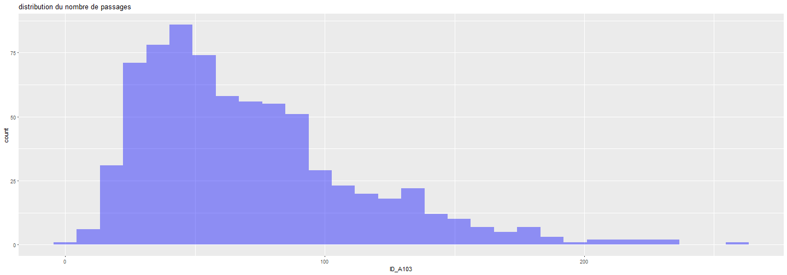

Distribution ventilée par type de structure
========================================================

```r
p <- ggplot(urgences, aes(x=ID_A103, fill = ID_A4)) + geom_histogram(alpha=0.4) + theme(legend.position="top") # en précisant la couleur par un nom de variable, on demande le tracé d'un histogramme pour chaque modalité 
p
```

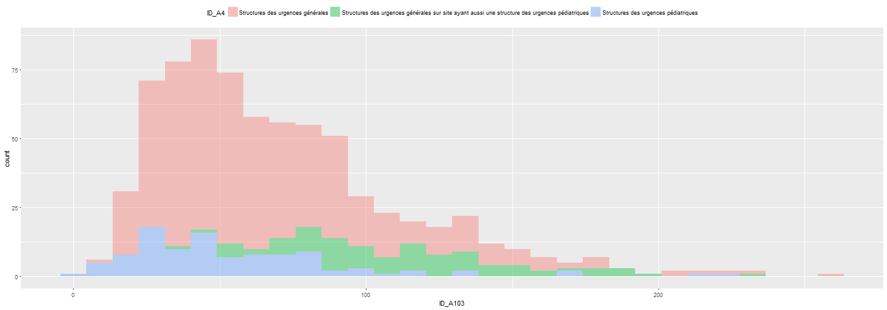


Graphique dynamique avec [ggplotly]
========================================================
Avec la fonction `ggplotly` de `plotly` on peut rendre le graphique interactif.


```r
library(plotly)
p<-ggplotly(p)#https://stackoverflow.com/questions/41187823/error-in-filecon-rb-cannot-open-the-connection-when-generating-a-plot-in
htmlwidgets::saveWidget(as.widget(p), file = "volume_de_patients.html")#Cette ligne de code et l'iframe en dessous permettent de faire fonctionner plotly dans le contexte de la presentation
```
Graphique dynamique avec [ggplotly]
========================================================
<iframe src="volume_de_patients.html" style="position:absolute;height:100%;width:100%"></iframe>

Suppression des valeurs manquantes [is.na & %in%]
========================================================
On va désormais transformer cette variable en variable qualitative pour rassembler les établissements de taille similaire 


```r
valeurs_manquantes <- is.na(urgences$ID_A103) # on regarde si la variable admet des valeurs manquantes, 
head(valeurs_manquantes)
```

```
[1] FALSE FALSE FALSE FALSE FALSE FALSE
```

```r
(TRUE %in% valeurs_manquantes) # c'est le cas 
```

```
[1] TRUE
```

```r
sum(valeurs_manquantes) # nb de valeurs manquantes
```

```
[1] 1
```

Suppression des valeurs manquantes [na.omit]
========================================================
On va désormais transformer cette variable en variable qualitative pour rassembler les établissements de taille similaire 


```r
dim(urgences)
```

```
[1] 734  73
```

```r
urgences <- na.omit(urgences) # si on veut retirer toutes les lignes avec au moins une valeur manquante (pas toujours souhaitable)
dim(urgences)
```

```
[1] 725  73
```

Regroupement des établissements par volume de patients [cut]
========================================================
On va désormais transformer cette variable en variable qualitative pour rassembler les établissements de taille similaire 


```r
# on crée une nouvelle colonne
urgences$nb_passages_3 <- cut(urgences$ID_A103, breaks = c(0,40,80,max(urgences$ID_A103, na.rm=T))) # max, comme la plupart des fonctions renverra une erreur si appliqué sur un vecteur contenant des NA, on les enlève pour le calcul avec l'option na.rm 
table(urgences$nb_passages_3)
```

```

  (0,40]  (40,80] (80,263] 
     187      309      229 
```


Volume de patient ventilé par tranche horaire [prep]
========================================================
On voudrait maintenant regarder le nombre de patients ou les effectifs par tranche horaire, on voit bien qu'il serait plus facile d'avoir une variable tranche horaire que de considérer des colonnes différentes contenant tantôt un A, un B, un C etc... On va récupérer les colonnes correspondant à chaque horaire, les renommer, puis de les empiler en créant une colonne horaire 


```r
#NB : on doit transformer les facteurs en character pour pouvoir les empiler sinon des NA seront générés
horaire_8 <- urgences[,c(paste('ID_','A',c(87:90,92:101), sep =''),'ID_A103','ID_A4','nb_passages_3','ID_A2')]%>%
  mutate_if(is.factor,as.character) # sélection des colonnes contenant un A pour chaque établissement
horaire_12 <- urgences[,c(paste('ID_','B',c(87:90,92:101), sep =''),'ID_A103','ID_A4','nb_passages_3','ID_A2')]%>%
  mutate_if(is.factor,as.character) # sélection des colonnes contenant un B pour chaque établissement
horaire_18 <- urgences[,c(paste('ID_','C',c(87:90,92:101), sep =''),'ID_A103','ID_A4','nb_passages_3','ID_A2')]%>%
  mutate_if(is.factor,as.character) # sélection des colonnes contenant un C pour chaque établissement
horaire_22 <- urgences[,c(paste('ID_','D',c(87:90,92:101), sep =''),'ID_A103','ID_A4','nb_passages_3','ID_A2')]%>%
  mutate_if(is.factor,as.character) # sélection des colonnes contenant un D pour chaque établissement
horaire_8_ <- urgences[,c(paste('ID_','E',c(87:90,92:101), sep =''),'ID_A103','ID_A4','nb_passages_3','ID_A2')]%>%
  mutate_if(is.factor,as.character) # sélection des colonnes contenant un E pour chaque établissement
```

Volume de patient ventilé par tranche horaire [prep]
========================================================
On voudrait maintenant regarder le nombre de patients ou les effectifs par tranche horaire, on voit bien qu'il serait plus facile d'avoir une variable tranche horaire que de considérer des colonnes différentes contenant tantôt un A, un B, un C etc... On va récupérer les colonnes correspondant à chaque horaire, les renommer, puis de les empiler en créant une colonne horaire 


```r
head(horaire_8)
```

```
  ID_A87 ID_A88 ID_A89 ID_A90 ID_A92 ID_A93 ID_A94 ID_A95 ID_A96 ID_A97
1      1      1      6      2      3      0      0      0      1      2
2      1      1      8      0      3      0      1      0      1      6
3      1      0      0      0      2      0      0      0      1      2
4     10      0      4      1      1      0      0      0      1      2
5      2      0      4      2      2      0      0      0      1      2
6      0      0      0      0      3      2      1      0      2      5
  ID_A98 ID_A99 ID_A100 ID_A101 ID_A103
1      2      0       1       0      57
2      2      2       1       2     111
3      0      0       1       0      51
4      1      0       1       0      52
5      0      1       2       0      63
6      5      1       2       0      76
                                                                                           ID_A4
1                                                              Structures des urgences générales
2                                                              Structures des urgences générales
3                                                              Structures des urgences générales
4                                                              Structures des urgences générales
5                                                              Structures des urgences générales
6 Structures des urgences générales sur site ayant aussi une structure des urgences pédiatriques
  nb_passages_3     ID_A2
1       (40,80] 010005239
2      (80,263] 010780054
3       (40,80] 010780062
4       (40,80] 010780195
5       (40,80] 010780203
6       (40,80] 020000063
```

Volume de patient ventilé par tranche horaire [prep]
========================================================

```r
horaire_8$heure <- '8h'#on rajoute une colonne d'heure 
horaire_12$heure <- '12h'
horaire_18$heure <- '18h'
horaire_22$heure <- '22h'
horaire_8_$heure <- '8h_'
#pour pouvoir empiler les 5 tables il faut qu'elles aient les mêmes noms de colonnes 
common_names <- c(paste('ID_',c(87:90,92:101), sep =''),'ID_A103','ID_A4','nb_passages_3','ID_A2','heure')
names(horaire_8) <- common_names
names(horaire_12) <- common_names
names(horaire_18) <- common_names
names(horaire_22) <- common_names
names(horaire_8_) <- common_names
urgences2 <- rbind(horaire_8, horaire_12, horaire_18, horaire_22, horaire_8_)%>%mutate_if(is.character,factor) # on les empile avec rbind
# urgences2[apply(urgences2,1,function(x)sum(is.na(x))>0),]
```

Volume de patient ventilé par tranche horaire [check]
========================================================

```r
dim(urgences)
```

```
[1] 725  74
```

```r
dim(urgences2)
```

```
[1] 3625   19
```

```r
head(urgences2)
```

```
  ID_87 ID_88 ID_89 ID_90 ID_92 ID_93 ID_94 ID_95 ID_96 ID_97 ID_98 ID_99
1     1     1     6     2     3     0     0     0     1     2     2     0
2     1     1     8     0     3     0     1     0     1     6     2     2
3     1     0     0     0     2     0     0     0     1     2     0     0
4    10     0     4     1     1     0     0     0     1     2     1     0
5     2     0     4     2     2     0     0     0     1     2     0     1
6     0     0     0     0     3     2     1     0     2     5     5     1
  ID_100 ID_101 ID_A103
1      1      0      57
2      1      2     111
3      1      0      51
4      1      0      52
5      2      0      63
6      2      0      76
                                                                                           ID_A4
1                                                              Structures des urgences générales
2                                                              Structures des urgences générales
3                                                              Structures des urgences générales
4                                                              Structures des urgences générales
5                                                              Structures des urgences générales
6 Structures des urgences générales sur site ayant aussi une structure des urgences pédiatriques
  nb_passages_3     ID_A2 heure
1       (40,80] 010005239    8h
2      (80,263] 010780054    8h
3       (40,80] 010780062    8h
4       (40,80] 010780195    8h
5       (40,80] 010780203    8h
6       (40,80] 020000063    8h
```

Volume de patient ventilé par tranche horaire [prep]
========================================================

```r
# on va remplacer les variables 'ID_A103', 'ID_A4' et 'ID_A2' par des noms de variables intelligibles
names(urgences2)[names(urgences2)=='ID_A103'] <- 'nb_passages'
names(urgences2)[names(urgences2)=='ID_A4'] <- 'type_structure'
names(urgences2)[names(urgences2)=='ID_A2'] <- 'index_structure'
```

Voici l'equivalent dplyr

```r
urgences2 <- urgences2%>%rename(nb_passages=ID_A103,type_structure=ID_A4,index_structure=ID_A2)
```

Volume de patient ventilé par tranche horaire [ggplot]
========================================================
On peut regarder le nombre de médecins urgentistes `ID_92` en fonction de la tranche horaire et de la taille de la structure avec un graphique à boites.

```r
# sapply(urgences2, class) #attention certaines variables numériques ne sont pas considérées comme telles !
urgences2[,1:15] <- lapply(urgences2[,1:15],function(v) as.numeric(as.character(v))) # on les convertit
p<-ggplot(data = urgences2, aes(x=heure, y=ID_92, color=nb_passages_3)) + geom_boxplot() + ylab('Effectif de médecin urgentiste')
```


Volume de patient ventilé par tranche horaire [ggplot]
========================================================
<iframe src="effectif_urgentiste.html" style="position:absolute;height:100%;width:100%"></iframe>


Volume de patient ventilé par tranche horaire [dplyr group_by & summarise]
========================================================

Si on veut plutôt regarder l'évolution du nombre moyen de médecins urgentistes dans des établissements de taille similaire au cours de la journée, il va falloir d'abord calculer cette moyenne par groupe (les groupes étant identifiés par les 3 classes construites précédemment en rendant qualitative la variable des nombres de passages et par l'heure de pointage). Pour cela on va faire appel au package `dplyr`, vous devez l'installer si ce n'est pas déjà fait.


```r
grouped <- group_by(urgences2, heure, nb_passages_3)
grouped_mean <- summarise(grouped, mean=mean(ID_92, na.rm = T))
head(grouped_mean)
```

```
# A tibble: 6 x 3
# Groups: heure [2]
  heure nb_passages_3  mean
  <fct> <fct>         <dbl>
1 12h   (0,40]         1.14
2 12h   (40,80]        1.90
3 12h   (80,263]       3.80
4 18h   (0,40]         1.13
5 18h   (40,80]        1.90
6 18h   (80,263]       3.53
```

```r
# les deux actions peuvent être réalisées dans la foulée avec l'opérateur %>%
grouped_mean <- urgences2 %>% group_by(heure, nb_passages_3) %>% summarise(mean=mean(ID_92, na.rm = T))
```


Volume de patient ventilé par tranche horaire [ggplot]
========================================================

```r
g <- ggplot(data = grouped_mean, 
       aes(x=heure, 
           y=mean, 
           group = nb_passages_3, 
           color = nb_passages_3)) + 
  geom_line() + 
  geom_point() 
g + theme(legend.text = element_text(size = 20),text = element_text(size = 20))
```

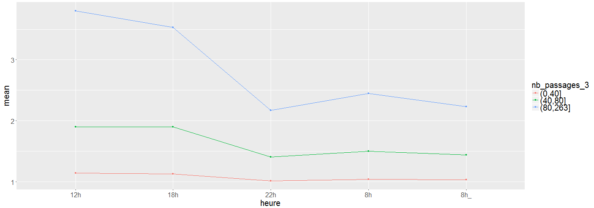
Remarque : les fonctionnalités du packages `dplyr` sont bien plus riches, allez jeter un oeil à la cheatsheet data wrangling french fournie dans le dossier de la formation.

Ventilation par type de personnel de soin [prep]
========================================================
Maintenant on va regarder l'évolution de la distribution des effectifs de personnels dans le temps, sans se limiter aux médecins urgentistes. Pour présenter les différents graphiques côte à côte, on va utiliser l'option `facet` de `ggplot2` mais avant cela, il faut retravailler encore la forme des données. Commençons par regarder les distributions d'effectifs de professionnels, donc les variables de 90 à 101, que l'on va rendre plus intelligible dans un premier temps.


```
  index_structure nb_passages_3 heure ID_90 ID_92 ID_93 ID_94 ID_95 ID_96
1       010005239       (40,80]    8h     2     3     0     0     0     1
2       010780054      (80,263]    8h     0     3     0     1     0     1
3       010780062       (40,80]    8h     0     2     0     0     0     1
  ID_97 ID_98 ID_99 ID_100 ID_101
1     2     2     0      1      0
2     6     2     2      1      2
3     2     0     0      1      0
```

```
  index_structure nb_passages_3 heure              PS effectif
1       010005239       (40,80]    8h med urgentistes        2
2       010780054      (80,263]    8h med urgentistes        0
3       010005239       (40,80]   12h med urgentistes        2
4       010780054      (80,263]   12h med urgentistes        0
5       010005239       (40,80]   18h med urgentistes        0
6       010780054      (80,263]   18h med urgentistes        0
```

Ventilation par type de personnel de soin [prep]
========================================================
Maintenant on va regarder l'évolution de la distribution des effectifs de personnels dans le temps, sans se limiter aux médecins urgentistes. Pour présenter les différents graphiques côte à côte, on va utiliser l'option `facet` de `ggplot2` mais avant cela, il faut retravailler encore la forme des données. Commençons par regarder les distributions d'effectifs de professionnels, donc les variables de 90 à 101, que l'on va rendre plus intelligible dans un premier temps.


```r
urgences_ps <- urgences2[,c('index_structure','nb_passages_3','heure','ID_90','ID_92','ID_93','ID_94','ID_95','ID_96','ID_97','ID_98','ID_99','ID_100','ID_101')]
names(urgences_ps)[4:length(urgences_ps)] <-c('med urgentistes', 'med non urgentistes','internes','médecins int et ext', 'cadres','IDE','AS','ASH','secrétaires','brancardiers') # on rend les colonnes plus intelligibles
library(reshape)
urgences_ps <- melt(urgences_ps, id=c("index_structure","nb_passages_3",'heure')) 
```

Ventilation par type de personnel de soin [prep]
========================================================
Maintenant on va regarder l'évolution de la distribution des effectifs de personnels dans le temps, sans se limiter aux médecins urgentistes. Pour présenter les différents graphiques côte à côte, on va utiliser l'option `facet` de `ggplot2` mais avant cela, il faut retravailler encore la forme des données. Commençons par regarder les distributions d'effectifs de professionnels, donc les variables de 90 à 101, que l'on va rendre plus intelligible dans un premier temps.


```r
names(urgences_ps)[4:5] <-c('PS','effectif')
head(sample(urgences_ps),15)
```

```
   effectif nb_passages_3              PS index_structure heure
1         2       (40,80] med urgentistes       010005239    8h
2         0      (80,263] med urgentistes       010780054    8h
3         0       (40,80] med urgentistes       010780062    8h
4         1       (40,80] med urgentistes       010780195    8h
5         2       (40,80] med urgentistes       010780203    8h
6         0       (40,80] med urgentistes       020000063    8h
7         0       (40,80] med urgentistes       020000063    8h
8         0      (80,263] med urgentistes       020000261    8h
9         0        (0,40] med urgentistes       020000261    8h
10        0       (40,80] med urgentistes       020000394    8h
11        0        (0,40] med urgentistes       020000394    8h
12        0       (40,80] med urgentistes       020000535    8h
13        0       (40,80] med urgentistes       020004404    8h
14        1        (0,40] med urgentistes       020004495    8h
15        1        (0,40] med urgentistes       020010047    8h
```

Ventilation par type de personnel de soin [facet]
========================================================
On a donc créé une variable `PS` (pour professionnel de santé) qui prend plusieurs modalités et on a, pour chaque structure d'urgence identifiée par l'identifiant `ID_A2`, une ligne par profession avec les `effectif`s correspondants. Cette représentation rend la représentation graphique quasi immédiate avec `ggplot2`


```r
urgences_ps$heure = factor(urgences_ps$heure , levels=c("8h", "12h", "18h", "22h", "8h_")) # on transforme la variable en facteur et on ordonne les heures
g <- ggplot(urgences_ps, aes(x=PS, y=effectif, fill=PS)) + geom_bar(stat = "identity") + facet_grid(as.factor(heure) ~ nb_passages_3) + theme(axis.ticks.x=element_blank(),axis.text.x=element_blank(),legend.text = element_text(size = 20),text = element_text(size = 20))
# theme permet de retirer la légende sous l'axe des x, si vous retirez ce bout de code vous verrez la différence
# facet_grid permet de produire plusieurs graphiques en fixant une variable ici le nombre de passage ou l'heure de pointage
```

Ventilation par type de personnel de soin [facet]
========================================================

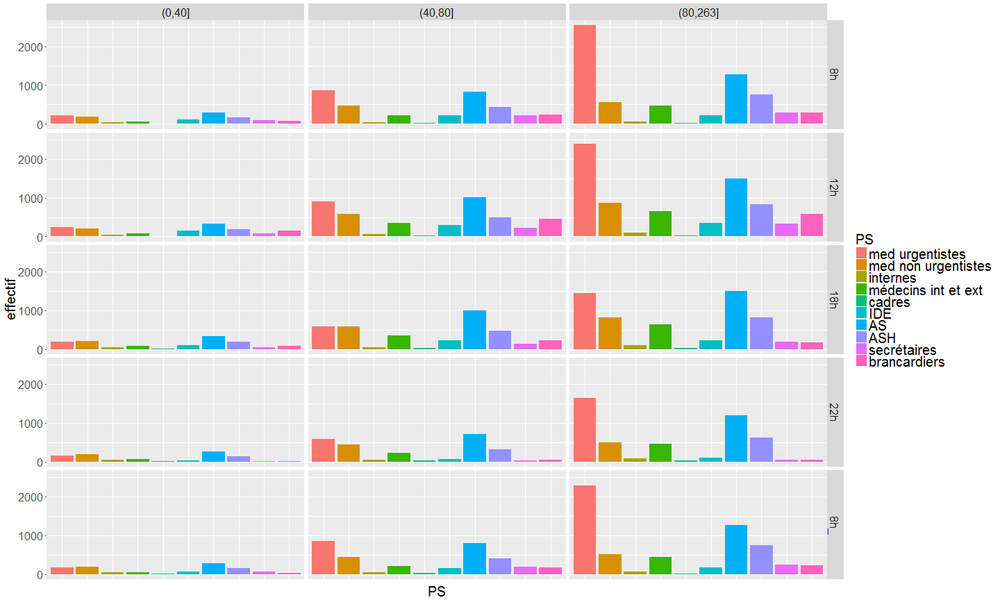

Variante - Exercice
========================================================
type:prompt
<b>Le même exercice peut être réalisé pour la distribution des types de patients, à vous de jouer</b>

Ouvrir une table SAS
========================================================
Enfin, nous allons représenter la répartition géographique des structures d'urgence en France. Pour cela nous allons utiliser la table sas `ej.sas7bdat` qui relie les codes FINESS des établissements avec leurs coordonnées géographiques. Cette base est stockée dans un format SAS, on va utiliser la librairie `haven` pour la lire.   


```r
library(haven)
ej <- read_sas(data_file = 'ej.sas7bdat')
head(ej)
```

```
# A tibble: 6 x 13
       X       Y SEGMENT adresse       com_code finess  finess_for loc_ign
   <dbl>   <dbl>   <dbl> <chr>         <chr>    <chr>   <chr>      <chr>  
1 102412 6848120    1.00 MAIRIE        29155    290010~ 29 001 04~ F Comm~
2 102545 6848012    1.00 PARC CHARLES  29155    290022~ 29 002 24~ E Zone 
3 112050 6840434    1.00 MAIRIE        29084    290027~ 29 002 75~ D Voie 
4 115797 6799829    1.00 ""            29083    290034~ 29 003 44~ F Comm~
5 115845 6799643    1.00 MAIRIE        29083    290027~ 29 002 74~ D Voie 
6 125094 6834900    1.00 10 R PIERRE ~ 29040    290007~ 29 000 77~ D Voie 
# ... with 5 more variables: loc_score <dbl>, reg_code <chr>, rs <chr>,
#   siren <chr>, statut <chr>
```

Preparation des données à cartographier
========================================================
Pour tracer sur une carte les structures d'urgence de notre table `urgences`, on va apparier notre table avec `ej`, sur la clé `finess` et `ID_A2` respectivement. On va bien faire attention à garder tous les codes finess de la base `urgences`


```r
urgences_loc <- merge(urgences[,c('ID_A2','ID_A4','ID_A103')],ej,by.x = 'ID_A2',by.y = 'finess', all.x = TRUE) #on garde aussi le type de structure et le nombre de passages
head(urgences_loc)
```

```
      ID_A2
1 010005239
2 010780054
3 010780062
4 010780195
5 010780203
6 020000063
                                                                                           ID_A4
1                                                              Structures des urgences générales
2                                                              Structures des urgences générales
3                                                              Structures des urgences générales
4                                                              Structures des urgences générales
5                                                              Structures des urgences générales
6 Structures des urgences générales sur site ayant aussi une structure des urgences pédiatriques
  ID_A103        X       Y SEGMENT                  adresse com_code
1      57       NA      NA      NA                     <NA>     <NA>
2     111 871098.5 6569398       1         900 RTE DE PARIS    01053
3      51 908658.0 6521508       1      52 R GEORGES GIRERD    01034
4      52       NA      NA      NA                     <NA>     <NA>
5      63       NA      NA      NA                     <NA>     <NA>
6      76 719367.4 6973707       1 1 R MICHEL DE L HOSPITAL    02691
    finess_for   loc_ign loc_score reg_code
1         <NA>      <NA>        NA     <NA>
2 01 078 005 4 F Commune       100       82
3 01 078 006 2    D Voie       100       82
4         <NA>      <NA>        NA     <NA>
5         <NA>      <NA>        NA     <NA>
6 02 000 006 3  A Plaque       100       22
                                   rs     siren statut
1                                <NA>      <NA>   <NA>
2      CH DE BOURG EN BRESSE FLEYRIAT 260100045     13
3                 CH DOCTEUR RÉCAMIER 260100037     13
4                                <NA>      <NA>   <NA>
5                                <NA>      <NA>   <NA>
6 CENTRE HOSPITALIER DE SAINT QUENTIN 260208616     13
```

```r
dim(urgences)
```

```
[1] 725  74
```

```r
dim(urgences_loc)
```

```
[1] 725  15
```

```r
dim(ej)
```

```
[1] 55511    13
```

Attention geocoding imparfait
========================================================
type : alert
Le fait d'avoir indiqué l'option `all.x = TRUE` force à garder toutes les lignes de `urgences` même quand il n'existe pas de match possible. Ici certains codes finess ne semblent pas avoir de coordonnées géographiques disponibles. On ne va conserver que les structures qui ont des coordonnées grâce à `na.omit` 

```r
urgences_loc_sans_na <- na.omit(urgences_loc)
dim(urgences_loc_sans_na)
```

```
[1] 329  15
```
Seulement la moitié des structures sont géocodées
On va regarder la répartition des structures d'urgence par type de structure (repéré par la variable `ID_A4`).
La représentation de points sur une carte nécessite de maîtriser le concept de projection : https://medium.com/@_FrancoisM/introduction-%C3%A0-la-manipulation-de-donn%C3%A9es-cartographiques-23b4e38d8f0f.

Cartographie avec Leaflet - code
========================================================

```r
library(leaflet)
library(rgdal)
urgences_loc_sans_na <- na.omit(urgences_loc)

# Ce bloc permet de convertir les coordonnées en Lambert 93 en WGS 84 plus traditionnel
coordinates(urgences_loc_sans_na) <- c("X", "Y")
proj4string(urgences_loc_sans_na) <- CRS("+init=epsg:2154") # WGS 84
CRS.new <- CRS("+proj=longlat +ellps=WGS84 +datum=WGS84 +no_defs")
urgences_loc_sans_na <- spTransform(urgences_loc_sans_na, CRS.new)
urgences_loc_sans_na$lon <- data.frame(coordinates(urgences_loc_sans_na))$X
urgences_loc_sans_na$lat <- data.frame(coordinates(urgences_loc_sans_na))$Y


factpal <- colorFactor(topo.colors(3), urgences_loc_sans_na$ID_A4) # palette de 3 couleurs

m <- leaflet(urgences_loc_sans_na) %>% addTiles() %>%
                  addCircles(lng = ~lon, lat = ~lat, weight = 1,
                             radius = ~ID_A103*100, 
                             popup = ~paste(rs, ", nb de passages : ", ID_A103, ", type de structure :", ID_A4),
                             color = ~factpal(ID_A4), fillOpacity = 0.5) %>%
                  addLegend("bottomleft", title = "Type de structure d'urgences", pal = factpal, values = ~ID_A4, opacity = 0.7)%>% addProviderTiles(providers$OpenStreetMap)
htmlwidgets::saveWidget(as.widget(m), file = "carto.html") 
```

Cartographie avec Leaflet - résultat
========================================================

<iframe src="carto.html" style="position:absolute;height:100%;width:100%"></iframe>


